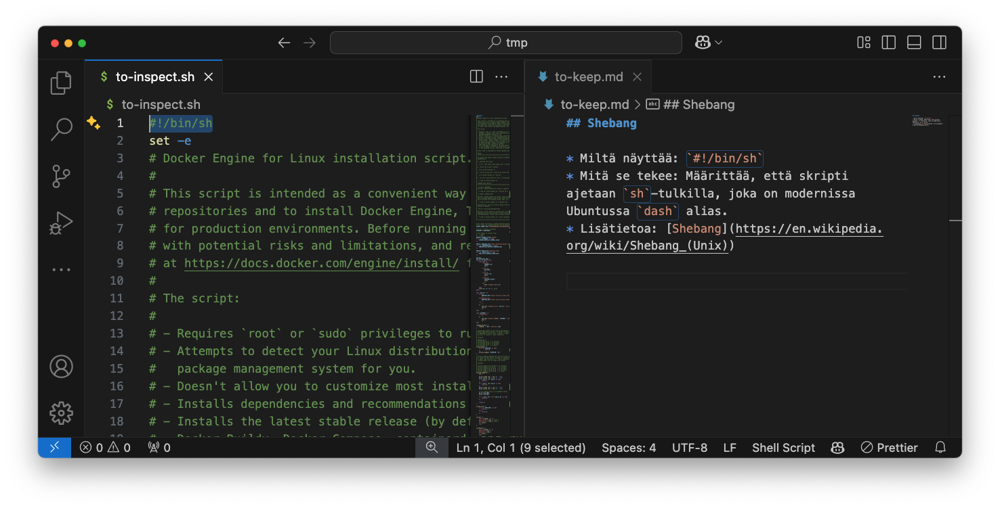

# Lukeminen

## Mistä on kyse?

Aloitetaan jo olemassa olevien skriptien lukemisesta. On kovin tyypillistä, että ohjelmiston asennuksen tai käyttöönoton yhteydessä sinua neuvotaan ajamaan online-hostattu skripti. Tyypillisesti vaihe näyttää tältä:

```bash title="Bash"
curl -sSLf https://example.com/install.sh | bash
```

!!! tip 

    Esimerkissä olevan komennon `curl` parametrit ovat:

    * `-s` tai `--silent`: Älä näytä lataustietoja.
    * `-S` tai `--show-error`: Näytä virheilmoitukset.
    * `-L` tai `--location`: Seuraa mahdollisia uudelleenohjauksia.
    * `-f` tai `--fail`: Lopeta, jos lataus epäonnistuu.

Koska netti on pullollaan skriptejä, joita sinua neuvotaan ajamaan eri tutoriaaleissa ja asennusohjeissa, on hyvä osata lukea niitä. Jos osaat lukea muiden skriptejä, kynnys kirjoittaa omia madaltuu. Samalla huomaat, että jopa ammattilaisten laatimat skriptit koostuvat kohtalaisen pienestä määrästä peruspalikoita.

## Esimerkkejä

### 🐳 Docker

Dockerin asennusvaiheeseen kuuluu kasa komentoja, jotka voi automatisoida skriptillä. Lue lisää [Install Docker Engine on Ubuntu: Install using the convenience script](https://docs.docker.com/engine/install/ubuntu/#install-using-the-convenience-script)

Itse skripti löytyy osoitteesta: [get.docker.com/](https://get.docker.com/)

### 🍺 Homebrew

Homebrew-paketinhallinta on macOS-käyttäjille tuttu *"apt:n korvike"*, mutta sen voi asentaa myös Linuxille. Ohjeistus on heti etusivulla: [brew.sh](https://brew.sh/).

Itse skripti löytyy osoitteesta: [raw.githubusercontent.com/Homebrew/install/HEAD/install.sh](https://raw.githubusercontent.com/Homebrew/install/HEAD/install.sh)

### 🐍 Uv

Uv on Pythonin verrattain tuore paketinhallintatyökalu, jota käytetään myös tällä kurssilla. Sen asennus hoidetaan niin Linux/macOS kuin Windows ympäristössä skriptin avulla. Tutustu [Installing uv](https://docs.astral.sh/uv/getting-started/installation/)-ohjeeseen.

Itse skripti löytyy osoitteesta: [astral.sh/uv/install.sh](https://astral.sh/uv/install.sh)

### 🦀 Rust

Rust on tuoreehko, melko paljon pöhinää aiheuttava ohjelmointikieli. Sillä koodatut sovellukset, kuten yllä mainittu uv, muistavat yleensä kertoa olevansa *blazingly fast*. Kieli soveltuu sulautettuihin järjestelmiin ja suorituskykyä vaativiin sovelluksiin, aivan kuten C/C++, joten emme suinkaan käytä sitä tällä kurssilla - mutta Rustin asennus onnistuu skriptillä, ja tähän me tutustumme. Tutustu [Install Rust](https://www.rust-lang.org/tools/install)-ohjeeseen.

Itse skripti löytyy osoitteesta: [sh.rustup.rs](https://sh.rustup.rs)

### 📦 Volta

Volta on Node.js:n versioiden hallintaan tarkoitettu työkalu, joka on jossain määrin vastaava kuin yllä mainittu `uv`, mutta Pythonin sijasta kielenä on JavaScript/Node.js. Tutustu [Getting Started](https://docs.volta.sh/guide/getting-started)-ohjeeseen.

Itse skripti löytyy osoitteesta: [get.volta.sh](https://get.volta.sh)

### Kokoelmat

Lisäksi voit tutustua myös communityn koostamiin kokoelmiin, joista löytyy yleensä hieman lyhyempiä snippettejä. Hyviä ovat ainakin:

* [gh:djeada/Bash-Scripts](https://github.com/djeada/Bash-Scripts)
* [gh:awesome-lists/awesome-bash](https://github.com/awesome-lists/awesome-bash)

## Esimerkki: Docker-skriptin parsiminen

Tämä toimii apuna myöhempää tehtävää varten. Alla on [get.docker.com](https://get.docker.com/)-skripti avattuna siten, että siitä löytyvät uniikit komennot tai syntaksin muodot on listattu auki.



**Kuva 1:** *Skripti ja muistiinpanot auki VS Codessa. Kun parsit skriptiä, tämä on yksi potentiaalinen työtapa. Tuhoa vasemmalta rivejä sitä mukaan kun olet käynyt, ja kirjoita uusia löydöksiä oikealla olevaan memo-tiedostoon. Lopuksi muotoile muistiinpanot julkaisukuntoon.*

### Bash-yleiset

| Syntaksi          | Mitä se tekee                                                    |
| ----------------- | ---------------------------------------------------------------- |
| `#!/bin/sh`       | Määrittää, että skripti ajetaan ko. polun ohjelmalla. [^shebang] |
| `set -e`          | Lopeta skripti välittömästi, jos komento epäonnistuu. [^set-e]   |
| `# Lorem ipsum`   | Kommentti. Ei vaikuta skriptin suoritukseen.                     |
| `set +x` tai `-x` | Laita debuggaustila päälle tai pois päältä. [^debug]             |
| `exit 1` tai `0`  | Lopeta skripti ja palauta virhekoodi. [^exit]                    |

[^shebang]: Wikipedia. Shebang (Unix). https://en.wikipedia.org/wiki/Shebang_(Unix)
[^set-e]: GNU. The Set Builtin. https://www.gnu.org/software/bash/manual/html_node/The-Set-Builtin.html
[^debug]: The Linux Documentation Project. Bash Guide for Beginners: 2.3. Debugging Bash scripts. https://tldp.org/LDP/Bash-Beginners-Guide/html/sect_02_03.html
[^exit]: GNU. Bourne Shell Builtins. https://www.gnu.org/software/bash/manual/html_node/Bourne-Shell-Builtins.html#index-exit

### Muuttujat

| Syntaksi               | Mitä se tekee                                                                            |
| ---------------------- | ---------------------------------------------------------------------------------------- |
| `FOO=bar`              | Määrittää muuttujan `FOO` arvolla `bar`.                                                 |
| `${VERSION#v}`         | Poistaa muuttujan `VERSION` arvosta etuliitteen `v`. [^param-exp-prefix]                 |
| `DRY_RUN=${DRY_RUN:-}` | Varmistaa, että muuttuja `DRY_RUN` ei ole unset.                                         |
| `$(uname -r)`          | Asettaa muuttujaan komennon tulosteen. Esim. `TODAY=$(date +%Y-%m-%d)`. [^command-subst] |

[^param-exp-prefix]: GNU. Shell Parameter Expansion. https://www.gnu.org/software/bash/manual/html_node/Shell-Parameter-Expansion.html
[^command-subst]: GNU. Command Substitution. https://www.gnu.org/software/bash/manual/html_node/Command-Substitution.html

### Ehtorakenteet

| Syntaksi                       | Mitä se tekee                                                    |
| ------------------------------ | ---------------------------------------------------------------- |
| `if [ ... ]; then ... fi`      | Suorittaa lohkon, jos ehto on tosi. [^if]                        |
| `case "$muuttuja" in ... esac` | Valitsee yhden monista vaihtoehdoista. Pitkän if elsen korvaaja. |
| `[ ehto ]`                     | POSIX-yhteensopiva ehto.                                         |
| `[ -z "$CHANNEL" ]`            | Tarkistaa, että muuttuja on tyhjä. [^conditional]                |
| `[ -n "$cli_pkg_version" ]`    | Tarkistaa, että muuttuja ei ole tyhjä. [^conditional]            |

[^if]: GNU. Conditional Constructs. https://www.gnu.org/software/bash/manual/html_node/Conditional-Constructs.html
[^conditional]: GNU. Bash Conditional Expressions. https://www.gnu.org/software/bash/manual/html_node/Bash-Conditional-Expressions.html

### Silmukat

| Syntaksi                     | Mitä se tekee                                             |
| ---------------------------- | --------------------------------------------------------- |
| `while [ ... ]; do ... done` | Suorittaa lohkon niin kauan kuin ehto on tosi. [^looping] |

[^looping]: GNU. Looping Constructs. https://www.gnu.org/software/bash/manual/html_node/Looping-Constructs.html


### Funktiot

| Syntaksi                   | Mitä se tekee                                |
| -------------------------- | -------------------------------------------- |
| `command_exists() { ... }` | Määrittää funktion nimeltään command exists. |
| `command_exists`           | Ajaa funktion command_exists.                |

### Tulostus

| Syntaksi                                          | Mitä se tekee                                           |
| ------------------------------------------------- | ------------------------------------------------------- |
| `echo "Illegal option $1"`                        | Tulostaa merkkijonon terminaaliin. [^echo]              |
| `printf "\033[91;1mDEPRECATION WARNING\033[0m\n"` | Tulostaa muotoillun merkkijonon terminaaliin. [^printf] |


[^echo]: GNU. Bash Builtins. https://www.gnu.org/software/bash/manual/html_node/Bash-Builtins.html#index-echo
[^printf]: GNU. Bash Builtins. https://www.gnu.org/software/bash/manual/html_node/Bash-Builtins.html#index-printf

### Vaikeammat tapaukset

#### cat (heredoc)

* Miltä näyttää:
 
    ```bash
    cat >&2 <<-'EOF'
        Warning: the "docker" command...

        ... monta riviä tekstiä ...

        You may press Ctrl+C now to abort this script.
    EOF
    ```

* Mitä se tekee: Tulostaa monirivisen tekstin terminaaliin. `>&2` ohjaa tulosteen virhevirtaan.

#### Shift

* Miltä näyttää: `shift`
* Mitä se tekee: Siirtää positionaalisia argumentteja vasemmalle. Esim. jos skripti saa argumentteja, niin ensimmäinen argumentti poistetaan ja muut siirtyvät vasemmalle. Katso alta *Positionaaliset argumentit*, jossa tälle annetaan hieman kontekstia.

#### Ternary operaattori

* Miltä näyttää: `$(( ehto ? jos_totta : jos_epätotta ))`
* Mitä se tekee: Palauttaa joko `jos_totta` tai `jos_epätotta` riippuen ehdosta. Katso alta *Positionaaliset argumentit*, jossa tälle annetaan hieman kontekstia.

#### Positionaaliset argumentit

* Miltä näyttää: `$#`
* Mitä se tekee: Palauttaa positionaalisten argumenttien määrän.
* Miksi se on käytössä: Se parsii skriptille annetut argumentit muuttujiin.

Tämä on ==muita skriptin tekijöitä haastavampi kokonaisuus==, ja on ok, jos se ei heti tunnu ilmiselvältä. Docker-asennusskriptissä sitä käytetään parsimaan skriptille annetut argumentit muuttujiin, näin:

```bash
while [ $# -gt 0 ]; do
    case "$1" in
        --foo)
            FOO="$2"
            shift
            ;;
        --bar)
            BAR="$2"
            shift
            ;;
        --toggle)
            TOGGLE=1
            ;;
        *)
            echo "Illegal option $1"
            exit 1
            ;;
    esac
    shift $(( $# > 0 ? 1 : 0 ))  # Siirrä argumentteja vasemmalle, jos niitä on jäljellä
done
```

Kyseisen skriptin voisi ajaa: 
```bash title="Bash"
# Näin
./skripti.sh --foo arvo1 --bar arvo2 --toggle

# Tai eri järjestyksessä
./skripti --toggle -bar arvo2 --foo arvo1
```

Järjestyksestä riippumatta lopputulema on, että `FOO=arvo1`, `BAR=arvo2` ja `TOGGLE=1`.
* Lisätietoa: [Positional Parameters](https://www.gnu.org/software/bash/manual/html_node/Positional-Parameters.html)


## Tehtävät

!!! question "Tehtävä: Parsi Bash-skripti"

    Ota mallia yllä olevasta Docker-skriptin parsimisesta, ja parsi jokin muu:

    * uv
    * Homebrew
    * Rust
    * ...tai jokin löytämäsi, joka edustaa samaa vaikeustasoa.

    Kirjoita ylös löytämäsi syntaksin palaset, jotka ovat uniikkeja. Voit tehdä tämän esimerkiksi seuraavasti:

    1. Lataa tiedosto: `curl -sSLf https://example.com/install.sh > to-inspect.sh`
    2. Avaa Visual Studio Codessa: `code to-inspect.sh`
    3. Aloita tiedoston ylhäältä ja prosessoi se rivi riviltä.
   
    Tee seuraavat toimenpiteet **jokaiselle koodiriville**:

    * ✅ Jos koodirivi sisältää entuudestaan vierasta syntaksia: dokumentoi se. 📄
    * 🔁 Jos koodirivin syntaksi on jo esiintynyt aiemmin scriptissä: unohda rivi. 🫳
    * Tämän jälkeen poista kyseinen koodirivi tiedostosta.
 
    Kun olet käynyt koko tiedoston läpi, sinulla pitäisi olla dokumentoitu lista uniikeista syntaksin palasista. Muotoile tämä itsellesi sopivaksi listaksi. Lista voi olla kuten yllä oleva, tai jos keksit paremman tavan muotoilla samat asiat, käytä sitä.

    !!! tip "Ajansäästöä tekoälyllä! 🤖"

        Tässä tehtävässä on suorastaan suositeltua käyttää tekoälyä apuna selittämään, mitä kyseiset Bash-kielen entuudestaan tuntemattomat koodirimpsut tekevät. Jos muotoilet kysymyksen oikein, kielimalli tarjoaa sinulle jopa linkit Bashin dokumentaatioon. 
        
        HUOM! ==Tarkista vastaus, linkki ja linkin sisältö!== Vastuu vastauksen oikeellisuudesta on sinulla!

## Lähteet