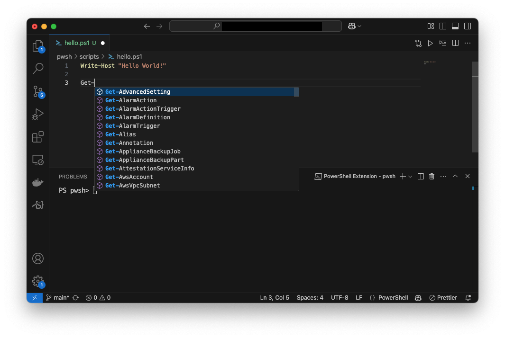

# 🎆 Strontium

## Tärpit

### Format Operator

Löydät tästä lisätietoa [about_Operators](https://learn.microsoft.com/en-gb/powershell/module/microsoft.powershell.core/about/about_operators?view=powershell-7.5#format-operator--f)-dokumentaatiosta. Alla lyhyt käyttöohje:

```powershell
$a = 42
$b = "The Universe"
$c = "Life"
$d = "Everything"

# Tulostaessa tarvit sulut
Write-Host ("The answer to {0}, {1}, and {2} is: {3}" -f $c, $b, $d, $a)
```

## Mukavuus

### Visual Studio Coden käyttö

!!! warning

    Mukavuus-otsikon alla on oletus, että sinulla on käytössä Visual Studio Code, PowerShell Extension ja lokaalisti asennettu PowerShell.

Bash-kielessä on hyvin pieni määrä sisäänrakennettuja komentoja, joten kyseistä kieltä kirjoittaa melko kevyesti ilman *code autocompletion* ominaisuutta. PowerShellin kanssa tätä kannattaa opetella hyödyntämään.



**Kuva 1:** Kun kirjoitat `Get-`, aukeaa valikko, josta voit valita haluamasi cmdletin. PowerShell Extensionin käyttö nopeuttaa kirjoittamista ja vähentää virheitä.

Muita hyödyllisiä pikaneuvoja ovat:

- ++f8++ : Aja maalattu osa komentoa VS Code Terminalissa (ei kontissa!)
- ++f1++ : Avaa komentopaneeli.
    - Kirjoita hakukenttään `PowerShell` ja katso mitä kaikkea löydät.
- ++ctrl+comma++ : Avaa asetukset. 
    - Kirjoita hakukenttään `@ext:ms-vscode.powershell` ja saat esille kaikki PowerShell Extensionin asetukset. (🍎 Mac: ++command+comma++:)

PowerShell Extensionin asetuksiin pääset painamalla `Ctrl+,` ja kirjoittamalla hakukenttään `PowerShell`. Täältä löydät kaikki asetukset, joita voit muokata.


### Promptin muokkaus

Jos/kun käytät lokaalia PowerShelliä syntax highlightingin toimivuuden takaamiseksi tai ympäristöä muokkaamattomien srkriptien ajamiseksi, olet varmasti huomannut, että prompt on tyypillisesti melko pitkä. Se on esimerkiksi:

```pwsh-session
PS /home/john/Code/johnanderton/skriptiohjelmointi-2025/pwsh>
```

Eikö olisi mukavampaa, jos prompt olisi:

```pwsh-session
PS pwsh>
```

Bashistä sinulle pitäisi olla tuttua Start-up -tiedosto `.bashrc` ja ympäristömuuttuja `PS1`, joka säätää sinun promptiasi. PowerShellissä hitusen vastaava tiedosto on profiilitiedosto, jonka sijainti sinulle selviää komennolla:

```pwsh-session title="🖥️ PowerShell"
PS> $profile

# tai ks. kaikki
PS> $profile | Select-Object *

# avaa haluamasi VS Codessa
PS> code $profile.CurrentUserAllHosts

# kun olet muokannut, käynnistä joko shell tai sourcea profiilitiedosto
PS> . $profile.CurrentUserAllHosts
```

Promptin muotoilusta vastaa funktio `prompt`. Voit ylikirjoittaa tämän funktion yhden istunnon ajaksi terminaalissa. Pysyvämpi muutos syntyy muokkaamalla profiilitiedostoa, koska se ladataan joka kerta PowerShellin käynnistyessä. Tutustu tähän liittyviin helppeihin (about_Prompts, about_Profiles).

```powershell title="🖥️ /path/to/your/profile.ps1"
function prompt {
    switch ((Get-Location).Provider.Name) {
        FileSystem { $p = Split-Path -leaf -path (Get-Location) }
        Default { $p = (Get-Location).Drive.Name }
    }

    "PS $p> "
  }
```

Pyörää ei kannata keksiä uusiksi. Yllä oleva prompt on muokattu [superuser: Configure Windows PowerShell to display only the current folder name in the shell prompt](https://superuser.com/questions/446827/configure-windows-powershell-to-display-only-the-current-folder-name-in-the-shel)-keskustelun vastauksista. Vaihtoehtoinen tapa olisi käyttää valmiita teemoja esimerkiksi [oh-my-posh](https://ohmyposh.dev/):n avulla.

!!! warning

    Muista, että sinun on pitänyt ajaa `/app/scripts/localhelp.ps1`, joka lataa koneelle tallennetun helpin, tai komento `Update-Help`, joka lataa helpin netistä, jotta help oikeasti sisältää jotakin. Vaihtoehto on toki lukea esimerkiksi [about_Prompts](https://learn.microsoft.com/en-us/powershell/module/microsoft.powershell.core/about/about_prompts) verkosta.

## Tehtävät

??? question "Tehtävä: Arvaa numero"

    Luo ohjelma, joka generoi luvun väliltä 1-1000 ja pyytää käyttäjää arvaamaan sen. Ohjelma antaa vihjeen, onko arvattu luku suurempi vai pienempi kuin generoitu luku. Ohjelma lopettaa, kun käyttäjä arvaa oikein. Tämä on jo kerran tehty Bashilla, joten voit käyttää sitä pohjana logiikan suhteen.

    Lisää ohjelmaan ominaisuus, että se kellottaa käyttäjän peliajan ja tulostaa sen lopuksi ruudulle. Pelatessa tulosteen pitäisi myötäillä alla olevaa esimerkkiä:

    ```pwsh-session
    Arvaa luku väliltä 1-1000
    =================================================
    Arvaa luku: 369
    📉 Liian pieni 

    Arvaa luku: 371
    📈 Liian suuri 

    Arvaa luku: 370
    🎉 Oikein! Arvasit luvun 370 

    Peliaika: 00:00:10.1029581
    ```

    Varmista, että pelaaja voi halutessaan lopettaa pelin. Minun toteutuksessa mikä tahansa muu syöte kuin kokonaisluvuksi parsittava syöte lopettaa pelin (esim. `exit` tai tyhjä merkkijono).

    ??? tip "Vihje"

        ```powershell
        help *random*
        ```

    ??? tip "Vihje"

        Peliajan kellottamiseen voit käyttää `System.Diagnostics.Stopwatch`-luokkaa. Ohje löytyy PowerShell Communityn [DevBlogs: Measuring average download time](https://devblogs.microsoft.com/powershell-community/measuring-download-time/) -artikkelista.

??? question "Tehtävä: Reminder"


    Aivan kuten ylempi, myös tämä tehtävä on sinulle tuttu Bash-osiosta. Luo kaksi ohjelmaa, jotka toimivat yhdessä. Toinen luo, toinen näyttää muistiinpanoja.

    * `install_remind.ps1`
        * Luo aliakset `remind` ja `remember`, jotka suorittavat `remind.ps1`- ja `remember.ps1`-skriptit.
    * `remember`
        * Kysyy käyttäjältä muistutuksia, jotka tallennetaan `$HOME/.reminder`-tiedostoon. 
        * Tyhjä syöte lopettaa muistutusten kirjoittamisen.
        * Formaatti: `[timestamp] Muistutus`
    * `reminder`
        * Tulostaa koko muistutustiedoston sisällön.

    Alla esimerkki asennuksen ja kummankin sovelluksen toiminnasta. Komentojen väliin on lisätty tyhjä rivi lukemisen helpottamiseksi:

    ```pwsh-session title="🐳 PowerShell"
    PS /> . /app/scripts/remind_install.ps1

    PS /> remember
    Enter note (quit with empty note)
    >>> : Buy an egg
    >>> : Buy a chicken
    >>> : Which one first? Help!
    >>> :
    
    PS /> remind
    Your reminders are as follows:
    [1739541147]	Buy an egg
    [1739541151]	Buy a chicken
    [1739541156]	Which one first? Help!
    ```

??? question "Tehtävä: Verb-Noun generaattori"

    Kehitä generaattori, `rnd-cmdlet.ps1`, joka luo uudenlaisia cmdlet-päteviä nimiä, kuten `Get-Pizza` tai `Set-Spam`. Tee ohjelma siten, että, verbi arvotaan PowerShellin käytössä olevista verbeistä. Substantiivi sen sijaan noudattaa seuraavaa logiikkaa:

    * Jos käyttäjä antaa argumentin skriptille, käytä sitä.
    * Jos ei, yritä noutaa substantiivi REST API:sta.
        * Osoite: `https://random-word-api.herokuapp.com/word`
    * Jos ei onnistu, poimi satunnainen sana sanakirjasta.

    REST API:n kutsumiseen saat apua alemmasta vinkistä, jos et itse keksi ratkaisua.

    Jos tarvitset helpomman tehtävän

    ??? tip "Vinkki Verbi"

        Kokeile komentoa `Get-Verb`.

    ??? tip "Vinkki REST API"

        ```pwsh
        function getNoun {
            try {
                $url = "https://random-word-api.herokuapp.com/word"
                $response = Invoke-RestMethod -Uri $url -Method Get
                $noun = (Get-Culture).TextInfo.ToTitleCase($response[0])
            }
            catch {
                Write-Warning "Using a predefined list."
                $noun = Get-Random -InputObject $nounVocabulary
            }

            return $noun
        }
        ```

??? question "Tehtävä: Staattinen analyysi (PSScriptAnalyzer)"

    Bashin kanssa käytimme ohjelmaa `shellcheck`, joka analysoi skriptin ja antaa palautetta mahdollisista virheistä. PowerShellille vastaava työkalu on `PSScriptAnalyzer`. Sen pitäisi olla asennettuna ja aktiivsena, mutta voit tarkistaa, löytyykö se Get-Module cmdletillä:

    ```pwsh-session
    PS> Get-Module
    ```

    Jos ei ole:

    ```pwsh-session
    PS> Install-Module -Name PSScriptAnalyzer -Force
    ```


    Tämän jälkeen tarkista skriptisi:
    
    ```pwsh-session
    PS> Invoke-ScriptAnalyzer -Path ./scripts/*.ps1
    ```

    Korjaa kaikki virheet ja varoitukset. Jos jokin virhe toistuu useita kertoja, harkitse Find & Replace -toiminnon käyttöä Visual Studio Codessa. Ole kuitenkin varovainen, ettet korvaa jotain, mitä et halua korvata!

    !!! tip

        Huomaat, että analyzer löytää virheitä, joista PowerShell Extensionin tavallinen linter ei varoita.
