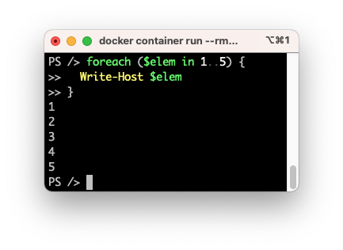

# PowerShell 101

## Perusteet

### Missä ajetaan?

#### Docker

Jotta sinun on mahdollista tehdä tämän kurssin tehtäviä, sinulla on oltava PowerShell käytössä. Jos teet skriptejä, jotka poistavat tiedostoja tai tekevät jotakin muuta vaarallista, on suositeltavaa ajaa PowerShelliä Docker-kontissa. Tämän pitäisi olla sinulle tuttua jo aiemmasta Bash-osiosta. Kontti noudetaan Docker Hubin sijasta [Microsoft Artifact Registry: PowerShell](https://mcr.microsoft.com/en-us/artifact/mar/powershell/about)-katalogista. Kontti rakentuu Ubuntun päälle, mutta siihen on asennettu PowerShell riippuvuuksineen, ja vakio CMD ei ole `bash`, vaan `pwsh`.

!!! tip

    Jos haluat harjoitella Microsoft Windows -spesifisiä komentoja, kuten `Get-Service`, tarvitset Windows-ympäristön. Docker luo Linux-kontteja. Emme käsittele Windows-komentoja tässä kurssissa, mutta voit kokeilla niitä omalla koneellasi, mikäli sinulla on Windows-kone käytössäsi.

#### Local Machine

On kovin tyypillistä, että Dockeria suositellaan lääkkeeksi aivan kaikkeen. Tulet huomaamaan, että jos ajat kaiken koodin väliaikaisessa kontissa, koodin syntaksia värittävä VS Code **PowerShell Extension** ei toimi. Kyseinen Extension, aivan kuten muiden kielten vastaavat, tarvitsevät pääsyn kielen runtimeen, jotta ne voivat tarjota sinulle koodin täydennystä, syntaksivärittelyä ja muuta.

Helpoin tapa ratkaista tämä? Asenna PowerShell lokaalisti, olit sitten Windows-, macOS- tai Linux-käyttäjä. Voit yhä ajaa vaaralliset tai epävarmat skriptit Docker-kontissa, mutta voit kirjoittaa ja testata skriptisi lokaalisti.

#### Dev Container

Voit yrittää *best of both worlds*-ratkaisua Visual Studio Coden Dev Containers -ominaisuuden avulla. Tämä on kuitenkin edistyneempi aihe. Emme käsittele sitä tässä kurssissa.

### Mikä se on?

PowerShell on Microsoftin kehittämä skriptauskieli ja komentotulkki. Se on suunniteltu alunperin Windows-ympäristöön, mutta nykyään se on saatavilla myös Linuxille ja macOS:lle. Jos tarkkoja ollaan, niin tuotteita on kaksi, joista vain toinen on saatavilla muille kuin Windowsille:

* Ⓜ️ Windows PowerShell
    * Asentuu Windowsin mukana. Perustuu kaupalliseen .NET Frameworkiin. Tuorein versio on 5.1 eikä Microsoft enää kehitä sitä.
    * Executable: `powershell.exe`
* Ⓜ️🍎🐧 PowerShell
    * Asennetaan erikseen. Tuorein versio on 7.x ja Microsoft kehittää sitä aktiivisesti.
    * Executable: `pwsh`

!!! warning 

    Huomaa, että kaikkia moduuleita tai cmdlettejä ei ole saataville kaikille alustoille. Esimerkiksi moduulin `Microsoft.PowerShell.Management` komento `Get-Service` ei toimi Linuxissa. Tämä johtuu .NET Frameworkin ja .NET Coren eroista. [^5.1vs7difference]

[^5.1vs7difference]: Microsoft. Differences between Windows PowerShell 5.1 and PowerShell 7.x. https://learn.microsoft.com/en-us/powershell/scripting/whats-new/differences-from-windows-powershell

### Entäpä .NET?

Dotnet (.NET) on kehitysympäristö (engl. *developer platform*), jolla on useita tehtäviä ja joka koostuu useista eri osista. Ekosysteemiin kuuluu esimerkiksi ajoympäristö (engl. *runtime envinronment*) Common Language Runtime (CLR), joka on vastuussa koodin suorittamisesta Java virtuaalikoneen tapaan. Suoritettava koodi on Common Intermediate Language (CIL) tavukoodia. Ekosysteemi sisältää näiden lisäksi kirjastoja, kääntäjän, SDK ja muuta. Varsinaiset CIL-kieleksi käännettävät dotnet-ohjelmointikielet ovat C# ja F#. PowerShell on sekä tulkki (komentokehote, CLI) että skriptauskieli, joka käyttää .NETin kirjastoja. Sitä ei luonnollisesti käännetä, vaan sitä tulkataan dynaamisesti ajon aikana PowerShell runtimen toimesta. [^introdotnet]

[^introdotnet]: Microsoft. Introduction to .NET. https://learn.microsoft.com/en-us/dotnet/core/introduction

Jos ylempi kappale meni aivan ohi, niin tärkeää on sisäistää, että .NET kirjastoja voi kutsua PowerShellistä, koska se on .NET-ympäristössä toimiva kieli. PowerShellin cmdletit ovat käärittyjä .NET-kirjastojen kutsuja. Käytännössä seuraavat kaksi tekevät jossain määrin saman asian, joskin muotoilu on erilainen:

```pwsh
# PowerShell cmdlet
Get-Process

# .NET Library the cmdlet wraps
[System.Diagnostics.Process]::GetProcesses()
```

!!! info

    Namespacen ensimmäinen osa, esim. `System`, voidaan usein jättää pois. Näin esimerkiksi `[System.Math]` on sama kuin `[Math]`.

Dotnet-kirjastojen avulla voi saada C#:stä tuttuja toiminnallisuuksia työkalupakkiisi. Esimerkkinä tästä olkoot luvun korottaminen potenssiin, joka hoituu PowerShellissä näin:

```pwsh title="PowerShell"
# Näin
$result = [Math]::Pow(10, 2)

# Ja tulosta
[Console]::WriteLine($result)

# ...tai lyhyemmin
Write-Host $result
```

Ja C#:ssä näin:

```csharp title="C#"
using System;

class Program {
    static void Main() {
        double result = Math.Pow(5, 2);
        Console.WriteLine(result);
    }
}
```

### Erot Bashiin

PowerShellissä käsitellään pääasiassa objekteja. Tämä tulee jatkumaan myöhemmin Python-osiossa: myös se kieli on rankasti objekteihin suuntautunut.

> "A key difference with Bash is that it is mostly objects that you manipulate rather than plain text" [^learn_pwsh_in_y_minutes]

[^learn_pwsh_in_y_minutes]: Schandevijl et. al. 2025. Learning PowerShell in Y Minutes. https://learnxinyminutes.com/powershell/

Käytännössä tämä tarkoittaa sitä, että esimerkiksi kokonaisluku on objekti, ja objektilla on metodeja. 

!!! tip 

    Voit siis ajaa one-liner komennon: `$number = 10; $number.GetType()`. Ruutuun tulostuu taulukkomuotoinen näkymä, jonka sisällöstä ja muodosta vastaa [Out-Default](https://learn.microsoft.com/en-us/powershell/module/microsoft.powershell.core/out-default). Huomaa, että komennossa kutsutaan numeon omaa metodia `GetType()`, joka palauttaa tiedon siitä, minkä tyyppinen objekti on kyseessä. Tätä et voi Bashissä tehdä.

## Ensimmäinen kontti

Alla olevan `docker container run` komento on Bash-osiosta tuttu, joskin käytämme eri imagea. Komento käynnistää PowerShellin Docker-kontissa.

```pwsh title="Bash | Git Bash | PowerShell | CMD"
docker container run --rm -it mcr.microsoft.com/powershell 
```

??? warning "🍎 Apple Silicon -käyttäjille"

    Yllä mainittu image ei välttämättä toimi macOS-koneella, jossa on Silicon-prosessi (M1, M2, ...). Voi toki olla, että tilanne on muuttunut sitten tämän ohjeen kirjoittamisen, mutta jos kyseinen image kaataa Terminaalin jatkuvasti, kokeile arm64:lle käännettyä imagea, joka perustuu Microsoftin kehittämään Mariner-jakeluun (alias Azure Linux).

    ```
    # macOS ARM64
    docker container run --rm -it mcr.microsoft.com/powershell:mariner-2.0-arm64
    ```

Docker-komento ja sen parametrit (`--rm` ja `-it`) ovat sinulle jo tuttuja Bash-osiosta. Alla olevassa koodissa tulostetaan PowerShellin versiotiedot Docker-kontissa. Alempana näet tulosteen. Komento on ajettu samana päivänä sekä Ubuntu- että macOS-koneella, jälkimmäisessä käyttäen `mariner`-imagea.

```pwsh title="PowerShell @ Docker"
$PSVersionTable
```

=== "Ubuntu amd64"

    ```plaintext title="stdout @ Docker"
    Name                           Value
    ----                           -----
    PSVersion                      7.4.2
    PSEdition                      Core
    GitCommitId                    7.4.2
    OS                             Ubuntu 22.04.4 LTS
    Platform                       Unix
    PSCompatibleVersions           {1.0, 2.0, 3.0, 4.0…}
    PSRemotingProtocolVersion      2.3
    SerializationVersion           1.1.0.1
    WSManStackVersion              3.0
    ```

=== "macOS arm64"

    ```plaintext title="stdout @ Docker"
    Name                           Value
    ----                           -----
    PSVersion                      7.4.6
    PSEdition                      Core
    GitCommitId                    7.4.6
    OS                             CBL-Mariner/Linux
    Platform                       Unix
    PSCompatibleVersions           {1.0, 2.0, 3.0, 4.0…}
    PSRemotingProtocolVersion      2.3
    SerializationVersion           1.1.0.1
    WSManStackVersion              3.0
    ```

### Komennot ja apu

Varsinaiset komennot ovat `cmdlet`-tyyppisiä. Ne koostuvat verbistä ja substantiivista. Alla esimerkki:

* `Verb-Noun`: pseudoesimerkki
* `Get-Process`: hakee prosessit
* `Get-Alias`: hakee aliasit komennoilla (esim. `dir` on `Get-ChildItem` komennon alias)
* `Update-Help`: päivittää PowerShellin helpin, ladaten rutkasti esimerkkejä ja lisäapua.

Mistä tahansa komennosta saat helpin muutamalla eri tavalla. Alla esimerkkejä, joissa halutaan saada lisää tietoa Get-ChildItem-komennosta:

```pwsh
# Kenties alkuun haluat ajaa:
Update-Help

# Get-Noun muoto
Get-Help Get-ChildItem

# Huomaa, että se ei ole case-sensitiivinen
get-help get-childitem

# Output on helpompi lukea less-ohjelmassa
Get-Help Get-ChildItem | less

# Lyhyt muoto (alias)
help Get-ChildItem

# Kysymysmerkki
Get-ChildItem -?
```

```plaintext
Verb-Noun -parameter value -anotherparameter anothervalue -switch
```

Kyseinen `Verb-Noun`-cmdlet-pohjainen syntaksi on PowerShellin ydin. Esimerkiksi `Get-Process` hakee prosessit ja `Stop-Process` pysäyttää prosessin.


## Skripti

Aivan kuten Bashin kohdalla, myös PowerShellissä skripti on tiedosto, joka sisältää yhden tai useamman komennon. Aivan kuten Bash, PowerShell on myöskin tulkki, jossa toimii samat komennot kuin skriptitiedostoissa.



*Kuva 1:* Yksinkertainen for-silmukka PowerShellissä ilman erillistä skriptitiedostoa. Komento on ajettu kontissa.

### Sisältö

Skripti on tiedosto, joka sisältää yhden tai useamman komennon. Tämä on sinulle Bashista tuttua, mutta PowerShellin kohdalla konvention mukainen tiedostopääte on `.ps1`. Huomaa, että shebang ei ole tarpeen, jos tiedosto ajetaan nimenomaan PowerShellissä. Tiedoston ei myöskään tarvitse olla executable eli `chmod +x` ei ole tarpeen.

```pwsh title="hello.ps1"
Write-Host "Hello, World!"
```

### Skriptien suorituspolitiikka (Ⓜ️ Windows)

On tärkeää huomata, että jos ajat PowerShelliä Windows-ympäristössä, sinun tulee ottaa huomioon execution policy. Kyseinen asetus säätää sitä, missä tapauksissa skriptejä saa suorittaa. Tavallisessa Windows Home/Pro -ympäristössä execution policy on **Restricted**, joka tarkoittaa, että mitään skriptejä ei saa ajaa. Yleisesti suositeltu asetus on **RemoteSigned**.

Jos et ole aikaisemmin tehnyt mitään PowerShell-skriptien ajoon liittyviä toimenpiteitä, suorita seuraava komento:

```pwsh title="PowerShell in Windows"
Set-ExecutionPolicy -ExecutionPolicy RemoteSigned -Scope CurrentUser
```

!!! tip

    Jos ajat PowerShelliä Docker-kontissa tai muutoin Linuxissa, sinun ei tarvitse huolehtia tästä: policy on vakiona Unrestricted, eikä RemoteSigned ole edes tuettu.

??? warning "Tietoturva-offtopic"

    RemoteSigned ei välttämättä toimi aivan kuten sen arvaisi toimivan. Se, onko tiedosto Internetistä ladattu vai ei, määrittyy `Zone.Identifier` -attribuutin perusteella. Tämä ongelma on kuitenkin helppo kiertää: poista attribuutti tiedostosta. Jos kokeilet ladata `Invoke-RestMethod`-komennolla skriptin, saatat yllättyä, kun sillä ei olekaan koko Zone.Identifieriä asetettuna, vaikka voisi kuvitella. Myös koko policy on helposti kierrävissä.

    Execution Policy ei ole siis sinänsä vahva turvamekanismi. Se lähinnä ehkäisee käyttäjää ajamasta skriptejä huomaamattaan.

### Tiedoston luominen

Tiedoston voi luoda millä tahansa tekstieditorilla, mutta on suositeltavaa käyttää Visual Studio Codea. Tämän käyttöön tutustutaan läsnätunneilla.

### Skriptin ajaminen

Skriptin voi ajaa monella tapaa. Tyypillinen tapa on relatiivinen polku. Koska me olemme samassa hakemistossa kuin skripti, relatiivinen polku on yksintaisesti `./<tiedostonimi>`:

```pwsh
# Relatiivinen polku
./hello.ps1
```

Absoluuttista polkua käyttäen:

```pwsh
# Linux
/root/hello.ps1

# Windows
C:\Users\user\hello.ps1
```

Kyseisen binäärin argumenttina:

```pwsh
# PowerShell Core
pwsh ./hello.ps1

# Windows PowerShell
powershell.exe ./hello.ps1
```

## Tehtävät 

!!! question "Tehtävä: PowerShell Hello World"

    Luo skriptitiedosto `hello.ps1`, joka tulostaa tekstin "Hello World". 

    Varmista, että saat sen ajettua ympäristössä, jossa koet kehittämisen mieluisaksi. Saat käyttää fyysistä konetta, virtuaalikonetta, Dockeria tai vastaavaa.

    **Suositus**: Docker

!!! question "Tehtävä: PowerShell informaatiohaku"

    Toimi kuten aiemmassa Bash-tiedonhakutehtävässä. Muodosta itsellesi hyödyllinen katalogi lähteistä. Alla muutama suositus, mistä aloittaa etsintä:

    1. [PowerShell Documentation](https://docs.microsoft.com/en-us/powershell/). Virallinen dokumentaatio. Varmista, että seuraat oikean version dokumentaatiota.
    2. [Markus Fleschutzin PowerShell repo](https://github.com/fleschutz/PowerShell). Sisältää sekä [cheat sheetin](https://github.com/fleschutz/PowerShell/blob/main/docs/cheat-sheet.md) että satoja PowerShell-skriptejä.
    3. [Learn PowerShell in Y Minutes](https://learnxinyminutes.com/powershell/). Cheat Sheet -tyylinen opas, josta selviää ydinasiat.
    4. [KAMK Finna](https://kamk.finna.fi/). Hakusanalla "PowerShell" löytyy esimerkiksi Jonathan Hassellin kirja "Learning PowerShell" vuodelta 2017.

    Myös Bashin kohdalla mainitut kirjalähteet eli KAMK Finna, Humble Bundlen ja O'Reillyn kirjasto ovat toimivia paikkoja etsiä tietoa - jälkimmäiset kaksi ovat toki maksullisia. Erityismaininnan arvoinen maksullinen kirja on Don Jones ja Jeffrey Hicksin [Learn PowerShell Scripting in a Month of Lunches 2nd ed. (Manning)](https://www.manning.com/books/learn-windows-powershell-in-a-month-of-lunches-second-edition).


## Lähteet