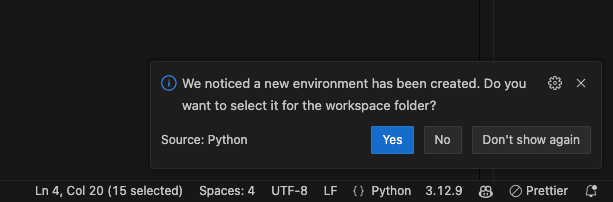
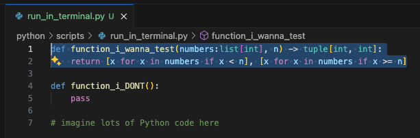
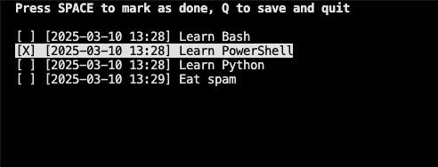

# 🎆 Strontium

## Tärpit

### Format Operator

Pythonin f-string on tehokas tapa formatoida merkkijonoja. Se on ollut käytössä Python 3.6:sta lähtien. F-stringin avulla voit lisätä muuttujia suoraan merkkijonoon. F-stringin tunnistaa siitä, että merkkijonon alkuun tulee `f`-kirjain. Esimerkiksi:

```python
name = "John"
age = 42

print(f"My name is {name} and I am {age} years old.")
```

Huomaa, että yksinkertaisen muuttujan ujuttamisen lisäksi f-string sallii uskomattoman määrän muotoilua, ja tyypillisen Python-lausekkeen käytön. Esimerkiksi:

```python
print(f"2 + 2 = {2 + 2}")
print(f"216 can be written as hex {216:X} and as binary {216:b}")
```

Voit tutustua tähän muotoiluun [Python f-string cheat sheets](https://fstring.help/cheat/) -sivuston avulla tai suoraan [Python Docs: String > Format String Syntax](https://docs.python.org/3/library/string.html#format-string-syntax).

## Mukavuus

### Visual Studio Coden käyttö

Mukavuus-otsikon alla on oletus, että sinulla on käytössä Visual Studio Code, Python Extension ja lokaalisti asennettu Python 3.1x. Python voi olla Ubuntun mukana tullut, Python.org-sivustolta ladattu, [uv](https://docs.astral.sh/uv/)-työkalulla asennettu tai jokin muu. Tärkeintä on, että Python on lisätty käyttöjärjestelmäsi PATH:iin ja on täten ajettavissa terminaalista komennolla `python` tai `python3`.

#### Venv

!!! warning

    Pythonin virtuaaliympäristöt eivät ole maailman helpoin aihe. Tulethan läsnätunneille paikalle, jotta saat tähän tukea ja neuvoja!

Kun luot uudet Python-projektin Visual Studio Codessa, sinulla voi olla tarve asentaa joitakin moduuleita. Olet jo aiemmin oppinut, että Debian-pohjaisessa ympäristössä on `dist-packages`-hakemisto, jossa on esimerkiksi `requests`-moduuli asennettuna. Jos olet jossakin toisesssa käyttöjärjestelmässä tai jakelussa, se voi hyvin puuttua sinulta. Tässä tapauksessa tarvitset virtuaaliympäristön.

Virtuaaliympäristö kuulostanee monimutkaiselta, mutta käytännön tasolla se on **kopio Python-asennuksesta**. 

Voit luoda sen seuraavalla tavalla:

=== "uv"

    Jos sinulla on [uv](https://docs.astral.sh/uv/), käytä ihmeessä sitä! Uv toimii Windowsissa, Linuxissa ja macOS:ssä samoin tavoin.

    ```bash title="🖥️ Bash"
    # Varmista, että olet projektisi hakemistossa
    $ cd mene/sinun/projektisi/hakemistoon
    
    # Asenna haluamasi Python
    $ uv install 3.12
    $ uv venv --python 3.12

    # Asenna virtuaaliympäristöön requests
    $ uv pip install requests

    # Aja uv:n hallinnoima Python
    $ uv python scripts/hello.py
    ```

=== "Ubuntu"

    Jos sinulla on käytössäsi Ubuntu, sen mukana tulee Python 3.xx. Uv on mukava työkalu, mutta vaihtoehtoisesti voit luoda virtuaaliympäristön seuraavasti.

    ```bash title="🖥️ Bash"
    # Varmista, että olet projektisi hakemistossa
    $ cd mene/sinun/projektisi/hakemistoon

    # Luo virtuaaliympäristö
    $ python3 -m venv .venv

    # Aktivoi virtuaaliympäristö 
    $ source .venv/bin/activate

    # Asenna haluamasi moduulit
    (.venv) $ pip install requests

    # Aja Python
    (.venv) $ python scripts/hello.py

    # Deaktivoi virtuaaliympäristö
    (.venv) $ deactivate
    ```

=== "Windows"

    Jos sinulla on Windowsiin asennettuna Python 3.xx, etkä halua jostain syystä asentaa uv:ta, aja seuraavat komennot.

    ```pwsh-session title="🖥️ PowerShell"
    # Varmista, että olet projektisi hakemistossa
    PS> cd mene/sinun/projektisi/hakemistoon

    # Suositeltu: kiellä pip:n käyttö virtuaaliympäristön ulkopuolella
    PS> pip3 config set global.require-virtualenv true

    # Luo virtuaaliympäristö
    PS> python3 -m venv .venv

    # Aktivoi virtuaaliympäristö
    PS> .venv\Scripts\Activate.ps1

    # Asenna haluamasi moduulit
    (.venv) PS> pip install requests

    # Aja Python
    (.venv) PS> python scripts/hello.py

    # Deaktivoi virtuaaliympäristö
    (.venv) PS> deactivate
    ```


!!! warning "Muista Git Ignore!"

    Ethän unohda lisätä kyseistä hakemistoa `.gitignore`-tiedostoon, jotta se ei päädy versionhallintaan! Se on kopio Pythonista, joten se sisältää satoja binääritiedostoja, jotka eivät todellakaan kuulu versionhallintaan. Kukin käyttäjä luo oman virtuaaliympäristönsä itse.

    Lisää siis seuraava rivi `.gitignore`-tiedostoon:

    ```plaintext
    .venv/
    ```

    Tarkista, että tiedostoja ei näy versionhallinnassa komennolla `git status -u`.

Huomaa, että on kaksi eri asiaa: käyttää virtuaaliympäristöä shell-istunnossa ja Visual Studio Coden GUI:ssa. Visual Studio Code yleensä havaitsee, jos luot virtuaaliympäristön, mutta ei aina. Visual Studio Code saattaa myös jatkossa aktivoida sen automaattisesti shell-istuntoon, mutta tämä riippuu asetuksesta:

```json title="$HOME/.config/Code/User/settings.json"
{
    // ...
    "python.terminal.activateEnvironment": false,
    // ...
}
```

Sen sijaan VS Coden GUI-editorin, eli ei siis integroidun terminaalin, käyttämä Python on valittavissa painamalla `F1` ja kirjoittamalla `Python: Select Interpreter`. Yleensä VS Code avaa alla näkyvän (ks. Kuva 1) pop-up -ikkunan ruudun oikeaan alalaitaan kun olet luonut virtuaaliympäristön. ==Jos tämä popup menee sinulta ohi== syystä tai toisesta, voit valita Workspace-kohtaisen virtuaaliympäristön painamalla `F1` ja kirjoittamalla `Python: Select Interpreter`. Kenttään voi kirjoittaa relatiivisen polun projektin uudesta esimerkiksi näin: `${workspaceFolder}/python/.venv/`. Tämä polun käsin kirjoittaminen on tarpeen vain, jos executable on jossakin muualle kuin avoinna olevan kansion juuressa (kuten `python/.venv` eikä `.venv/`).



**Kuva 1:** *Visual Studio Code ilmoittaa, että se on havainnut uuden virtuaaliympäristön, ja tarjoaa sinun valita sen kyseistä worskpacea varten. Klikkaa **Yes**.*

#### Intellisense

Aivan kuten PowerShell, myös Python on hyvin vahvasti *object-oriented* -kieli. Tämä tarkoittaa, että Pythonissa kaikki on objekteja, ja objekteilla on metodeja ja ominaisuuksia. Olet jo kokeillut samaa ominaisuutta PowerShellin kanssa, mutta kokeile uusiksi Pythonin kanssa. Luo esimerkiksi seuraava skripti:

```python title="testing_context_menu.py"
name = "John Anderton"
name
```

Kun lisäät sanan `name` perään vielä pisteen, aukeaa lista objektin metodeista ja ominaisuuksista. Kokeile esimerkiksi `name.upper()`. Jos lista ei aukea, paina ++ctrl+space++. Huomaa, että IntelliSense käyttää sitä Python-versiota, joka on valittu Visual Studio Codessa. Tämä neuvotaan yllä.

!!! tip "🍎 macOS"

    Sama pikanäppäin on ++fn+ctrl+space++

#### Run Selection

Joskus voi olla tarpeen ajaa valittu koodinpätkä lokaalin koneen terminaalissa. Kenties haluat nopeasti kokeilla, kuinka keskellä pitkää skriptiä määritelty funktio toimii ajamatta muuta koodia? Tämä onnistuu Visual Studio Codessa valitsemalla koodinpätkä ja painamalla ++shift+enter++. Vaiheoehtoinen tapa on context menu. Klikkaa hiiren oikealla korvalla valittuja koodirivejä, valitse **Run Python >** ja **Run Selection/Line in Python Terminal**.



**Kuva 2:** *Skripistä on valittuna vain yksi funktio, `function_i_wanna_test`, ja se ajetaan terminaalissa.*

Kun ajat koodin näin, huomaat, että alle Terminal-kohtaan ilmestyy uusi **Python**-niminen terminaali, jossa koodi suoritetaan REPL-tilassa. Tämä on vastaava tapa kuin ajaa aiemmin näkemäsi `python -i scripts/some.py`, mutta voit valita juuri ne rivit, jotka haluat suoritettavaksi. Kuten alla olevasta snippetistä näet, funktio on jatkossa kutsuttavissa kyseisessä terminaalissa.

```python-console title="🖥️ Python REPL (VS Code Terminal)"
>>> function_i_wanna_test([1,2,3,4,5,6], 3)
([1, 2], [3, 4, 5, 6])
```

## Tehtävät

??? question "Tehtävä: Arvaa numero"

    Luo ohjelma, joka generoi luvun väliltä 1-1000 ja pyytää käyttäjää arvaamaan sen. Ohjelma antaa vihjeen, onko arvattu luku suurempi vai pienempi kuin generoitu luku. Ohjelma lopettaa, kun käyttäjä arvaa oikein. Olet tehnyt ohjelman jo aiemmin (Bash ja PowerShell), joten voit lainata sieltä logiikan.

    ```console
    $ ./runpy.py scripts/arvaaluku.py
    Arvaa luku väliltä 1-1000.
    Muu syöte kuin positiviinen kokoluku poistuu ohjelmasta.

    Syötä arvaus:
    9
    📉 Luku on pienempi kuin 9.

    Syötä arvaus:
    7
    📈 Luku on suurempi kuin 7.

    Syötä arvaus:
    8
    🎉 Oikein! Arvasit luvun 8. (Peliaika: 0h 4m 18s)
    ```

    Varmista, että pelaaja voi halutessaan lopettaa pelin. Minun toteutuksessa mikä tahansa muu syöte kuin kokonaisluvuksi parsittava syöte lopettaa pelin (esim. exit tai tyhjä merkkijono).

    !!! note "⚠️ TÄRKEÄÄ"

        Kirjoita ohjelman `input()` ilman promptia. Anna prompti erillisellä print-komennolla. Tämä helpottaa kurssin myöhempää tehtävää, jossa rakennamme skriptin, joka pelaa peliä meidän puolestamme. Eli siis:

        ```python
        # ⛔️ Ei näin
        guess = input("Guess a number: ")

        # ✅ Vaan näin
        print("Guess a number: ")
        guess = input()
        ``` 

??? question "Tehtävä: Reminder"

    Tämän pitäisi olla sinulle jo tuttua. Luo kaksi ohjelmaa, jotka toimivat yhdessä. Toinen luo, toinen näyttää muistiinpanoja. Lisäksi on olemassa apuohjelma, joka lisää nämä PATH:iin.

    * `install_reminder.py`
        * Lisää `remind` ja `remember` symboliset linkit PATH:iin.
    * `remember`
        * Kysyy käyttäjältä muistutuksia, jotka tallennetaan `~/.reminder`-tiedostoon.
        * Tyhjä syöte lopettaa ohjelman.
        * Formaatti: `[YYYY-MM-DD HH:MM] Muistutus`
    * `remind`
        * Tulostaa muistutukset
        * Antaa mahdollisuuden poistaa muistutuksia TUI-käyttöliittymällä.

    Käytä TUI:n (Text User Interface) luomiseen `curses`-moduulia. Moduuli tulee Pythonin mukana Unix-like -järjestelmissä, joten sitä ei tarvitse asentaa erikseen.

    Lopulta käyttö näyttää tältä, kun komennot ajetaan kontin sisällä (`python runpy.py --bash`):

    ```console title="🐳 Bash"
    # python scripts/install_reminder.py
    Created symbolic link: /usr/local/bin/remind -> /app/scripts/remind.py
    Created symbolic link: /usr/local/bin/remember -> /app/scripts/remember.py
    
    # remember
    Enter a reminder: Learn Bash
    Enter a reminder: Learn PowerShell
    Enter a reminder: Learn Python
    Enter a reminder: Eat spam
    Enter a reminder: 
    Goodbye 👋! To view reminders, run: remind

    # remind
    ks. kuva alta
    ```
    

    **Kuva 3:** *Muistutusten lisääminen ja poistaminen TUI:n avulla.*

    ??? tip "Executable"

        Huomaa, että sinun tulee ==tehdä skripteistä suoritettavia== host-koneellasi, sillä kontissa kyseinen volume on read-only. Jos teet tätä kurssin osuutta Windowsista käsin, etkä voi tehdä tätä, luo skripti siten, että se luo symbolisen linkin sijasta aliaksen:

        ```bash
        alias remember="python3 /app/scripts/remember.py"
        alias remind="python3 /app/scripts/remind.py"
        ```

        Kuinkahan tämä onnistuu Pythonissa?

    ??? tip "Opettajan versio"

        Alla on opettajan versio siten, että osa riveistä on jemmattu. Muista, että tällä kurssilla koodin ymmärtäminen on tärkeää. Jos opettaja kysyy sinulta, mitä jokin rivi tekee, osaatko vastata?

        ```python
        #!/bin/env python3

        import curses
        from pathlib import Path

        TARGET = Path("~/.reminder").expanduser()

        def load_reminders() -> list[str]:
            pass

        def save_reminders(reminders: list[str]):
            pass

        def filter_and_save(reminders: list[str], sel: set[int]):
            kept_reminders = [
                rem for idx, rem in enumerate(reminders) if idx not in sel
            ]
            save_reminders(kept_reminders)

        def draw_menu(stdscr: curses.window, rem: list[str], curr: int, sel: set[int]):
            stdscr.clear()
            stdscr.addstr(
                0, 2, "Press SPACE to mark as done, Q to save and quit", curses.A_BOLD
            )

            for idx, reminder in enumerate(rem):
                # Highlight the current row
                attr = curses.A_REVERSE if idx == curr else curses.A_NORMAL

                # Add checkboxes
                if idx in sel:
                    button = "[X] "
                else:
                    button = "[ ] "
                stdscr.addstr(idx + 2, 2, button + reminder, attr)


        def reminder_app(stdscr: curses.window):
            curses.curs_set(0)   # Hide text cursor
            stdscr.keypad(True)  # Enable arrow keys
            stdscr.clear()

            reminders = load_reminders()
            if not reminders:
                raise SystemExit("No reminders found!")
            
            selected = set()
            current_row = 0

            while True:

                draw_menu(stdscr, reminders, current_row, selected)

                # Get event 
                key = stdscr.getch()

                if key == curses.KEY_UP and current_row > 0:
                    current_row -= 1
                elif key == curses.KEY_DOWN and current_row < len(reminders) - 1:
                    current_row += 1
                elif key == curses.KEY_RIGHT:
                    selected.add(current_row)
                elif key == curses.KEY_LEFT:
                    selected.remove(current_row)
                elif key in (ord("Q"), ord("q")):
                    filter_and_save(reminders, selected)
                    break

        if __name__ == "__main__":
            curses.wrapper(reminder_app)
        ```

??? question "Tehtävä: breakpoint()"

    Koska käytämme Visual Studio Codea, voimme käyttää sen interaktiivista debuggeria CLI-pohjaisen Pdb:n (Python Debugger) sijasta. Tämän käyttö esitellään läsnätunneilla. On kuitenkin suositeltavaa kokeilla Pdb:tä lyhyesti ihan sivistyksen tähden. Vastaavia työkaluja löytyy myös muista kielistä, kuten Pdb:n esikuva GDB, joka voi käyttää useissa kielissä: C, C++, Rust ja moni muu.
    
    Yksi tapa aktivoida Pdb on sijoittaa skriptiin alla olevassa code snippetissä oleva rivi. Rivin voi tarpeen mukaan ujuttaa useisiin paikkoihin, jolloin debuggeri pysähtyy jokaisen rivin kohdalla.

    ```python
    breakpoint()
    ```

    Koodi pysäyttää suorituksen kyseiseen kohtaan ja avaa Pdb:n. Tässä tilassa ei ole tarkoitus kirjoittaa interaktiivisesti Pythonia vaan tarkkailla muuttujien arvoja esimerkiksi looppia ajettaesa.

    ```python title="breakpoint_practice.py"
    #!/usr/bin/env python3

    n = 5
    counter = 0

    for i in range(n):
        breakpoint()
        counter += 1
    ```

    ```console
    $ ./runpy.py scripts/breakpoint_practice.py
    (Pdb) p counter
    0
    (Pdb) continue
    > /app/scripts/breakpoint_practice.py(8)<module>()
    -> counter += 1
    (Pdb) p counter
    1
    ```
    
    Debuggerissa toimivat muiden muassa seuraavat komennot [^pdb]:

    [^pdb] Python Docs. The Python Debugger. https://docs.python.org/3/library/pdb.html

    **Peruskomennot**

    | Komento      | Kuvaus                                          |
    | ------------ | ----------------------------------------------- |
    | `h(elp)      | Näytä ohjeet (eli kaikki nämä komennot)         |
    | `q(uit)      | Poistu debuggerista                             |
    | `c(ontinue)` | Jatka suoritusta seuraavaan breakpointtiin asti |
    | `n(ext)`     | Suorita seuraava rivi (astu funktiokutsun yli)  |
    | `s(tep)`     | Astu funktiokutsuun                             |
    | `r(eturn)`   | Suorita loppuun nykyinen funktio                |
    

    **Tarkastelu**

    | Komento   | Kuvaus                                       |
    | --------- | -------------------------------------------- |
    | `l(ist)`  | Näytä koodi breakpointin läheisillä riveillä |
    | `p expr`  | Tulosta lausekkeen arvo                      |
    | `pp expr` | Tulosta lausekkeen arvo (prettify)           |
    | `whatis`  | Näytä lausekkeen tyyppi                      |

    Lauseke (engl. expression) on usein muuttuja, mutta voi olla myös esimerkiksi funktio tai moduuli.

??? question "Tehtävä: IP Address"

    Kirjoita Python-skripti, joka:

    1. Käyttää built-in kirjastoa `ipaddress`.
    2. Kysyy käyttäjältä IP-osoitteen CIDR-notaatiolla (esim. `192.168.0.12/24`).
    3. Tulostaa seuraavat sekä desimaali- että binäärimuodossa:
        * Verkon osoite
        * Verkon maski
        * Ensimmäinen host ip
        * Viimeinen host ip
        * Broadcast ip

    Alla esimerkki käytöstä. Huomaa, että tulosteen ei tarvitse olla merkistä merkkiin muotoiltu samalla tavalla.

    ```console title="🖥️ Bash"
    ./runpy.py scripts/cidr_range.py
    Enter a network (CIDR notation): 10.0.2.42/23

    Label            IP Address       Binary                          
    ---------------------------------------------------------------------
    Network:         10.0.2.0         00001010 00000000 00000010 00000000
    Netmask:         255.255.254.0    11111111 11111111 11111110 00000000
    First IP:        10.0.2.1         00001010 00000000 00000010 00000001
    Last IP:         10.0.3.254       00001010 00000000 00000011 11111110
    Broadcast:       10.0.3.255       00001010 00000000 00000011 11111111
    ```

    ??? tip "Host-ip verkon osoitteeksi"

        Verkon osoite on se osoite, joka on ensimmäinen mahdollinen osoite kyseisessä verkossa. Käyttäjä saattaa ajatuksissaan antaa osoitteen, joka ei ole verkon vaan yksittäisen laitteen ip, kuten yllä olevassa esimerkissä (`192.168.0.12/24`). Saat muunnettua tämän verkon osoitteeksi käyttämällä `network_address`-metodin parametrina `strict=False`.

    ??? tip "Missä IP:t?"

        Huomaa, että `network.broadcast_address` palauttaa IPv4Network-olion. Kenties keksit käyttöä seuraaville:

        * `network.broadcast_address`
        * `list(network.hosts())` palauttaa `list[IPv4Address]` sisältäen vain hostit
        * `int(some_ipv4)` palauttaa desimaalimuodossa olevan ip:n

    ??? tip "IP neljäksi oktetiksi"

        Mikä tahansa numero on helppo tulostaa 32-bittiä pitkänä binäärinä. Se onnistuu f-stringin avulla (`{int(ip):032b}`). Sen tulostaminen 4 eri osassa, eli *oktetissa*, vaatii hieman koodia, mutta parantaa tulosteen luettavuutta. Tämän voi luonnollisesti tehdä monella tapaa. Alla helppolukuinen tapa:

        ```python
        def ip2bin(ip: ipaddress.IPv4Address) -> str:
        """
        Convert an IPv4 address to binary format with whitespace between octets, like:
        10000001 10000001 10000001 10000001
        """

        bit_32 = f"{int(ip):032b}"

        octets = []
        for i in range(0, 32, 8):
            octet = bit_32[i : i + 8]
            octets.append(octet)
        return " ".join(octets)
        ```
