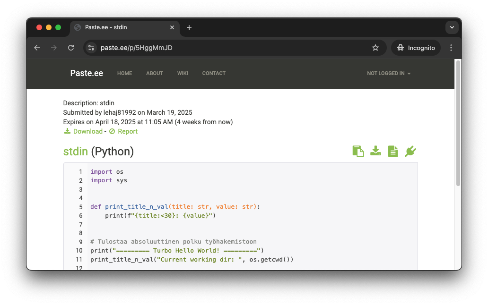

# 👨‍🔬 Einsteinium

## Tärpit

### Subprocess

Pythonin `subprocess`-kirjasto mahdollistaa muiden ohjelmien käynnistämisen ja niiden tulosteen lukemisen. Tämä on hyödyllistä, kun halutaan esimerkiksi testata ohjelmia automaattisesti tai käyttää ohjelmia osana skriptiä. Yksinkertaisissa skripteissä kannattaa hyödyntää ihan oikeaa shelliä, kuten Bash tai PowerShell. Jos komennon suorittaminen on osa suurempaa kokonaisuutta, tai komennon tuloste vaatii monimutkaista jatkokäsittelyä, Python ja `subprocess` voivat olla oikeutettu valinta.

```python title="subprocess_demo.py"
import subprocess

result = subprocess.run(
    ["cat", "/root/kissa.txt"],
    text=True,
    capture_output=True
)

print(f"STDOUT:")
print(result.stdout)
print(f"STDERR:")
print(result.stderr)
```

Yllä oleva toteutus tarkoittaa, että nämä kaksi komentoa tekevät käytännössä saman asian:

```console title="🐳 Bash"
$ echo /root/kissa.txt
...

$ python /scripts/subprocess_demo.py
...
```

??? tip "Skriptin tuloste"

    Alla tuloste siten, että kissa.txt ei ole olemassa ja sen jälkeen kun se on luotu.

    ```console title="🐳 Bash"
    $ python scripts/subprocess_demo.py 
    STDOUT:

    STDERR:
    cat: /root/kissa.txt: No such file or directory

    $ echo 'I am Puss in Roots!' > /root/kissa.txt
    $ python scripts/subprocess_demo.py 
    STDOUT:
    I am Puss in Roots!

    STDERR:
    ```

### Stdin lukeminen

Linuxista (ja PowerShellistä) sinulle pitäisi olla tuttua, että voit ohjata tulosteen toisen ohjelman syötteeksi. Edistynyt tapa käsitellä tätä on `subprocess.Popen`-luokka, joka ajaa valitun *child* ohjelman omassa prosesissa. Tästä saat esimakua *Arvaa luku botti* -tehtävässä. Pysytään kuitenkin hetki simppelissä esimerkissä, joka auttaa sinua *Paste.ee* -tehtävässä.

```python title="stdin_demo.py"
import sys

def print_whatever_is_given_to_stdin():
    if sys.stdin.isatty():
        print("No input string given", file=sys.stderr)
        sys.exit(1)
    for line in sys.stdin:
        print(line, end="")

print_whatever_is_given_to_stdin()
```

Yllä esitelty skripti tulostaa kaiken, mitä sille syötetään, paitsi jos syöte on TTY eli terminal device. Jos se **ei ole tty**, niin oletettavasti:

* Skripti on osa putkea, jossa se saa syötettä toiselta ohjelmalta.
    * Esim. `echo "Hello" | python stdin_demo.py`
* Skriptin syöte on uudelleenohjattu tiedostosta.
    * Esim. `python stdin_demo.py < /root/kissa.txt`

Alla skriptin ajo vielä esimerkkinä (rivivaihto lisätty luettavuuden parantamiseksi):

```console title="🐳 Bash"
$ alias thingy='python /app/scripts/stdin_demo.py'
$ echo "Hello" | thingy
Hello

$ echo 'Miau mau mou' >> /root/mirri.txt
$ echo 'Purr purrrrr' >> /root/mirri.txt
$ thingy < /root/mirri.txt 
Miau mau mou
Purr purrrrr
```

## Tehtävät


!!! question "Tehtävä: Paste.ee"

    Tehtäväsi on luoda skripti, jolla voit siirtää `stdout`:n sisällön [paste.ee](https://paste.ee/)-sivustolle. Skriptin tulee siis lukea standardisyötettä ja lähettää se paste.ee-sivustolle. Skriptin tulee tulostaa URL-osoite, josta skriptin voi käydä myöhemmin poimimassa. Tämä voi olla hyödyllistä, jos olet esimerkiksi asentanut Linuxille jotakin, mikä vaati useamman komennon. Kenties voit tällöin ajaa vaikkapa seuraavan:

    ```console
    $ history 50 | python /app/scripts/to_pastee.py
    ```

    Näin Bash-historyn viimeiset 50 riviä singahtaisi Paste.ee-sivustolle, josta voisit poimia ne myöhemmin dokumentaatiosi dokumentointiin. Tässä harjoituksessa opit käyttämään sekä tokeneita että POST-pyyntöä.

    Tarvitset tehtävässä seuraavat:

    * [paste.ee](https://paste.ee/)-käyttäjätunnuksen
    * [paste.ee API](https://paste.ee/account/api)-avaimen
        * Luo applikaatio esimerkiksi nimellä `skroh` ja ilman urlia.
        * Ota avain talteen. Se on pitkä merkkijono: `aBg************************************S5`
        * Tallenna se `scripts/.secret`
        * Lisää kyseinen tiedosto `.gitignore`-tiedostoon.
    * [pastee.ee API Documentation](https://pastee.github.io/docs/)
    * `requests`-kirjaston
  
    !!! note "🥷 Yksityisyysvinkki"
    
        Jos et halua sivuston saavan sinun oikeaa sähköpostiosoitetta, käytä jotakin väliaikaista sähköpostipalvelua, kuten [temp-mail.org](https://temp-mail.org/) tai [10minutemail.com](https://10minutemail.com/). Jos sivusto hakkeroidaan, oikea sähköpostisi ei ole vaarassa.

    Alla on opettajan luoma ohjelmarunko, josta voi olla apua. Vaihtoehtoisesti voit hylätä sen ja lähestyä ongelmaa omalla tavallasi.

    ??? tip "Opettajan vihjekoodi"

        ```python title="to_pastee.py"
        import sys
        import requests
        import argparse

        from dataclasses import dataclass
        from pathlib import Path


        @dataclass
        class NewPasteResponse:
            id: str
            link: str


        @dataclass
        class ParsedArguments:
            syntax: str
            dry_run: bool


        def read_secret() -> str:
            secret_file = Path("/app/scripts/.secret")
            secret = secret_file.read_text().strip()
            return secret


        def get_valid_syntaxes() -> list[str]:
            # You can get all 170+ from: GET https://api.paste.ee/v1/syntaxes
            return ["autodetect", "python", "powershell", "bash"]


        def get_stdin_lines() -> list[str]:
            return [line.rstrip("\n") for line in sys.stdin]


        def stdin_to_data_header(syntax="autodetect") -> dict:
            return {
                "description": "stdin",
                "sections": [
                    {
                        "name": "stdin",
                        "syntax": syntax,
                        "contents": "\n".join(get_stdin_lines()),
                    }
                ],
            }


        def parse_args() -> ParsedArguments:
            # IMPLEMENT ME
            return ParsedArguments(syntax="python", dry_run=True)


        def pretty_print_request(prepared_request: requests.PreparedRequest):
            # IMPLEMENT
            pass


        def post_to_pastee(data: dict, secret: str, dry_run: bool) -> NewPasteResponse | None:
            headers = {
                "Content-Type": "application/json",
                "X-Auth-Token": secret,
            }

            prepared_request = requests.Request(
                method="POST",
                url="https://api.paste.ee/v1/pastes",
                headers=headers,
                json=data).prepare()

            if dry_run:
                pretty_print_request(prepared_request)
                return NewPasteResponse(id="DRY-RUN", link="DRY-RUN")

            session = requests.Session()
            response = session.send(prepared_request)
            session.close()

            response_data = response.json()
            return NewPasteResponse(id=response_data["id"], link=response_data["link"])

        if __name__ == "__main__":
            # Get arguments
            args = parse_args()

            prepared_data = stdin_to_data_header(syntax=args.syntax)
            secret = read_secret()
            response = post_to_pastee(prepared_data, secret, args.dry_run)

            print(f"New paste created: {response.link}")
            print(f"ID: {response.id}")
        ```

    Jos opettajan koodin ajaa dry-run moodissa, tulostuu seuraava:

    ```console title="🐳 Bash"
    $ alias pastee='python /app/scripts/to_pastee.py'
    $ pastee --syntax python --dry-run < /app/scripts/hello_turbo.py 
    Dry run. The following request would be made:

    === URL ===
    https://api.paste.ee/v1/pastes

    === Headers ===
    {'Content-Type': 'application/json', 'X-Auth-Token': '********', 'Content-Length': '707'}

    === Body ===
    {"description": "stdin", "sections": [{"name": "stdin", "syntax": "python", "contents": "import os\n\nimport sys\n\n\n\n\n\ndef print_title_n_val(title: str, value: str):\n\n    print(f\"{title:<30}: {value}\")\n\n\n\n\n\n# Tulostaa absoluuttinen polku ty\u00f6hakemistoon\n\nprint(\"========= Turbo Hello World! =========\")\n\nprint_title_n_val(\"Current working dir: \", os.getcwd())\n\n\n\n# Tulostaa absoluuttinen polku skriptin sijaintiin\n\nprint_title_n_val(\"Skriptin sijainti: \", os.path.abspath(__file__))\n\n\n\n# Tulostaa kaikki lokaatiot, mist\u00e4 Python etsii moduuleita importtia varten\n\nprint(\"Python moduulien hakupolut:\")\n\nfor path in sys.path:\n\n    print(\"    \", path)\n"}]}"
    ```

    Ilman dry-run moodia tulostuu sekä URL että ID:

    ```console title="🐳 Bash"
    New paste created: https://paste.ee/p/jkHt7Rp5
    ID: jkHt7Rp5"
    ```

    

    **Kuva 1.** *Esimerkki paste.ee-sivustolle lähetetystä tiedostosta. Tiedosto näkyy kaikille, jotka tietävät URLin.*

    !!! note

        Käytännössä sinun ei tietenkään *tyypillisesti* tarvitse luoda omaa CLI-käyttöliittymää. Ubuntun `/bin/`-hakemiston Python-skriptejä plärätessä saatoikin huomata skriptin nimeltään `pastebinit`. Kyseinen skripti lähettää datat [paste.ubuntu.com/](https://paste.ubuntu.com/) tai [dpaste.com](https://dpaste.com/) sivustolle. Jälkimmäinen on vakio, jos sinulla ei ole tunnuksia lisättynä `~/bin/.pastebinit.xml`-tiedostoon. Vailla tunnuksia tehdyn postauksen huono puoli on luonnollisesti se, että et voi myöhemmin listata omia pasteja tai poistaa niitä. Se on seuraavat 30 päivää julkisesti online.

        Voit kokeilla tunnuksetonta postausta näin:

        ```console
        $ echo 'I am a happy penguin!' | pastebinit
        https://dpaste.com/BKZYVE9GZ

        $ man pastebinit
        ... lue lisää ...
        ```
        
        Myös muita vaihtoehtoja on olemassa, kuten `pastee-cli`, joka on Go:lla korjoitettu CLI, joka ajaa jotakuinkin saman asian kuin juuri sinun kirjoittamasi koodi.

??? question "Tehtävä: Premiere Markers to YouTube"

    Luo skripti, joka lataa netistä tekstitiedoston, joka sisältää Adobe Premierestä exportatut Chapter Markerit ja kääntää ne YouTuben [Video Chapters](https://support.google.com/youtube/answer/9884579?hl=en)-formaattiin. Output-formaatin voi liittää YouTube-videon kuvauskenttään ja videon aikajana katkotaan automaattisesti chapter-markerien kohdalta otsikoiduiksi osioiksi. Lopputuloksen pitäisi näyttää tältä:

    ```plaintext title="Haluttu formaatti"
    00:00 Intro
    00:29 Miksi Linux?
    01:06 Mikä WSL?
    ...
    32:22 Ubuntun tuhoaminen
    ...
    01:01:06 Ja lisähaasteena yli tunnin klipit
    ```

    !!! note "Lisähaaste"

        Entä jos video on yli tunnin mittainen? Voit lisähaasteena muotoilla formaatin automaattisesti siten, että tunnin ylittävät osiot saavat formaatin `01:00:00`.

    Alkuperäinen data löytyy [gh:sourander/skriptiohjelmointi/exercise-assets/data/premieremarkers.txt](https://raw.githubusercontent.com/sourander/skriptiohjelmointi/refs/heads/main/exercise-assets/data/premieremarkers.txt). Alla boilerplate-koodi, jolla pääset alkuun. Se lataa kyseisen tiedoston Path-tyypin muuttujaan. Parsi kyseisen muuttujan sisältö ja tulosta konsoliin ja/tai kirjoita uuteen tiedostoon.


    ```python title="premiere_markers_to_youtube.py"
    import csv
    import tempfile
    import requests
    from pathlib import Path

    URI = "https://raw.githubusercontent.com/sourander/skriptiohjelmointi/refs/heads/main/exercise-assets/data/premieremarkers.txt"

    def cache_internet_file(uri: str) -> Path:
        """ 
            Katso funktion toteutus aiemman luvun harjoituksesta.
        """
        print(f"[INFO] Downloaded data is available at: {temp_file_path}")
        return temp_file_path

    markers_file = cache_internet_file(URI)
    ```

    ??? bug "Odotettu bugi!"

        Jos tässä vaiheessa ajat tiedoston, niin sinulle pitäisi olla alla oleva tilanne ongelmineen. Huomaa, että käytössä on `python3 runpy.py --image skroh-python:3.12 --bash`-komennon alustama kontti, josta löytyy requests-kirjasto.

        ```console title="🐳 Bash"
        $ python scripts/premiere_markers_to_youtube.py
        [INFO] Downloaded data is available at: /tmp/premieremarkers.txt

        $ cat /tmp/premieremarkers.txt 

        $ python
        >>> from pathlib import Path
        >>> content = Path("/tmp/premieremarkers.txt").read_text()
        Traceback (most recent call last):
        File "<stdin>", line 1, in <module>
        File "/usr/local/lib/python3.12/pathlib.py", line 1028, in read_text
            return f.read()
                ^^^^^^^^
        File "<frozen codecs>", line 322, in decode
        UnicodeDecodeError: 'utf-8' codec can't decode byte 0xff in position 0: invalid start byte
        ```

        UniCodeError ei siis ole opettajan kämmi tiedostossa vaan odotettu ongelma, joka aiheutuu Premieren käyttämästä enkoodauksesta. Tämän korjaus on olennainen osa tehtävää. Skriptejä kirjoittaessa tulet kohtaamaan urallasi erilaisia enkoodausongelmia, joten tämä on aiheellinen harjoitus.

    ??? tip "Vinkki: Encoding"
        
        Huomaa, että Premiere kirjoittaa hyvin epätyyllistä enkoodausta. Jos luotat `markers_file.open()`-funktion. Voit päätellä tiedoston enkoodauksen joko lokaalisti lataamalla tiedoston ja avaamalla sen Visual Studio Codessa tai Pythonin avulla. Alla esimerkki:

        ```python
        def get_file_encoding(file_path: Path) -> str:
            with file_path.open("rb") as file:
                raw_data = file.read(32)
            if raw_data.startswith(codecs.BOM_UTF8):
                return "utf-8-sig"
            if raw_data.startswith(codecs.BOM_UTF16_LE):
                return "utf-16"
            if raw_data.startswith(codecs.BOM_UTF32_LE):
                return "utf-32"
            return "utf-8"

        encoding = get_file_encoding(markers_file)
        ```

        Python-ratkaisu voittaa rautakoodauksen siten, että Premiere saattaa jatkossa vaihtaa tavalliseen UTF-8 enkoodaukseen, jolloin koodi ei enää toimisi, jos rautakoodaat enkoodauksen. Vaihtoehtoisesti käyttäjä on saattanut avata tekstitiedoston jossakin editorissa, joka teki muutoksen automaattisesti. Myös tämä rikkoisi rautakoodatun toteutuksen.

    ??? tip "Vinkki: Timeformat"

        Alkuperäisen datan aikamuoto on `hh:mm:ss:frames`. Voit käytännössä unohtaa framet.


??? question "Tehtävä: Arvaa luku botti"

    Tämän tehtävän voi tehdä helpotettuna tai haastavana versiona. Helpostetussa versiossa korjaat tämän alla olevan koodin siten, että se pelaa `arvaaluku.py`-pelin läpi brute forcena eli syöttäen kaikki numerot 1:stä 1000:een, kunnes oikea ratkaisu löytyy. Lisäksi sinun tulee kommentoida koodi tai muutoin varmistaa, että ymmärrät, mitä koodi tekee.
    
    Haastavassa versiossa jatkat koodia siten, että implementoit kesken jääneen `binary_search()`-funktion loppuun ja lisäät mahdollisuuden vaihtaa ko. *solveriin* skriptin argumenttien avulla.

    Huomaa, että skriptiin on rautakoodattuna oletuksia `arvaaluku.py`-skriptin toiminnasta. Muokkaa jompaa kumpaa skriptiä, jotta ne toimivat yhteen.

    !!! note "Oletus 1"

        On oletus, että pyyntö sisältää sanan `syötä`, ja että tämä tulostetaan *erikseen* ennen `input()`-funktiota. Muutoin Pipe on huomattavan vaikea saada toimimaan reaktiivisesti kysymysten kanssa.

        ```python
        print("\nSyötä arvaus:")
        guess = int(input())
        ```

    !!! note "Oletus 2"

        On oletus, että ohjelman tuloste sisältää sanan `oikein` kun arvaus on oikein. Tämä on tärkeää, jotta solveri voi tietää, milloin lopettaa arvaaminen.

        ```python
        print(f"🎉 Oikein! ...")
        ```

    !!! tip 

        Kannattaa myös lisätä koodiin rivi, joka tulostaa oikean vastauksen. Tämä helpottaa testaamista ja sen tulkitsemista, että löytääkö `arvaaluku_bot.py` oikean vastauksen vai ei.

    ??? tip "Opettajan vihjekoodi"

        ```python title="arvaaluku_bot.py"
        import subprocess
        from pathlib import Path

        def brute_force(pipe: subprocess.Popen) -> int:
            guess = 1
            while guess < 1001:

                output = pipe.stdout.readline().strip()
                reply = None

                if output.startswith("Oikea"):
                    print(f"[PRE-GAME] {output}")
                    continue

                if "syötä" in output.lower():
                    pipe.stdin.write("500\n")
                    pipe.stdin.flush()
                    reply = pipe.stdout.readline().strip().lower()
                
                if reply:
                    if "oikein" in reply:
                        return guess
                    guess += 1

            return -1 # Not found

        def binary_search(pipe: subprocess.Popen) -> int:
            pass

        def guess_number(script: Path, solver):
            process = subprocess.Popen(
                [ "python", script],
                stdin=subprocess.PIPE,
                stdout=subprocess.PIPE,
                text=True, 
                encoding="utf-8"
            )

            # Call the solver function
            print(f"[INFO] Solver: {solver.__name__}")
            correct = solver(process)
            process.terminate()

            return correct

        if __name__ == "__main__":
            
            SCRIPT = Path("./scripts/arvaaluku.py")
            assert SCRIPT.exists(), f"Script not found: {SCRIPT.resolve()}"
            
            # Extra challenge: Handle different solvers with argparse
            # solvers = [brute_force, binary_search]
            # ...
            # solver = solvers[args.solver]
            solver = brute_force

            correct = guess_number(SCRIPT, solver)
            print(f"[MAIN] Correct number: {correct}")
        ```

    Alla on esiteltynä lopullinen koodin toimivuus ja käyttö `brute_force`-solverilla. Huomaa, että tuloste on säädetty siten, että se tulostaa vain `guess == 1` tai `guess % 50` arvaukset, jotta tuloste ei ole liian pitkä. Siksi vain joka viideskymmenes arvaus tulostetaan.

    ```console title="🐳 Bash"
    $ python scripts/arvaaluku_bot.py 
    [INFO] Solver: brute_force
    [PRE-GAME] Oikea vastaus: 380
    [BOT] Guessing: 1
    [>>>] 📈 luku on suurempi kuin 1.
    [BOT] Guessing: 50
    [>>>] 📈 luku on suurempi kuin 50.
    [BOT] Guessing: 100
    [>>>] 📈 luku on suurempi kuin 100.
    [BOT] Guessing: 150
    [>>>] 📈 luku on suurempi kuin 150.
    [BOT] Guessing: 200
    [>>>] 📈 luku on suurempi kuin 200.
    [BOT] Guessing: 250
    [>>>] 📈 luku on suurempi kuin 250.
    [BOT] Guessing: 300
    [>>>] 📈 luku on suurempi kuin 300.
    [BOT] Guessing: 350
    [>>>] 📈 luku on suurempi kuin 350.

    === Found ===
    [>>>] 🎉 oikein! arvasit luvun 380. (peliaika: 0h 0m 0s)
    [MAIN] Correct number: 380
    ```

    Alta voit klikata auki binary search -tulosteesta esimerkin:

    ??? tip "Binary Search tuloste"

        ```console
        python scripts/arvaaluku_bot.py 1
        [INFO] Solver: binary_search
        [PRE-GAME] Arvaa luku väliltä 1-1000.
        [PRE-GAME] Muu syöte kuin positiviinen kokoluku poistuu ohjelmasta.
        [PRE-GAME] Oikea vastaus: 622
        [PRE-GAME] 
        [PRE-GAME] Syötä arvaus:
        [BOT] Guessing: 500 (1⸺1000)
        [>>>] 📈 luku on suurempi kuin 500.
        [BOT] Guessing: 750 (501⸺1000)
        [>>>] 📉 luku on pienempi kuin 750.
        [BOT] Guessing: 625 (501⸺749)
        [>>>] 📉 luku on pienempi kuin 625.
        [BOT] Guessing: 562 (501⸺624)
        [>>>] 📈 luku on suurempi kuin 562.
        [BOT] Guessing: 593 (563⸺624)
        [>>>] 📈 luku on suurempi kuin 593.
        [BOT] Guessing: 609 (594⸺624)
        [>>>] 📈 luku on suurempi kuin 609.
        [BOT] Guessing: 617 (610⸺624)
        [>>>] 📈 luku on suurempi kuin 617.
        [BOT] Guessing: 621 (618⸺624)
        [>>>] 📈 luku on suurempi kuin 621.
        [BOT] Guessing: 623 (622⸺624)
        [>>>] 📉 luku on pienempi kuin 623.
        [BOT] Guessing: 622 (622⸺622)
        [>>>] 🎉 oikein! arvasit luvun 622. (peliaika: 0h 0m 0s)
        [MAIN] Correct number: 622
        ```

        Huomaa, että vastaus löytyy huonoimmassa tapauksessa `log2(1000)` eli ==kymmenellä arvauksella==, mikä on huomattavasti nopeampaa kuin brute force -ratkaisu, joka vaatii huonoimmassa tapauksessa 1000 arvausta.
