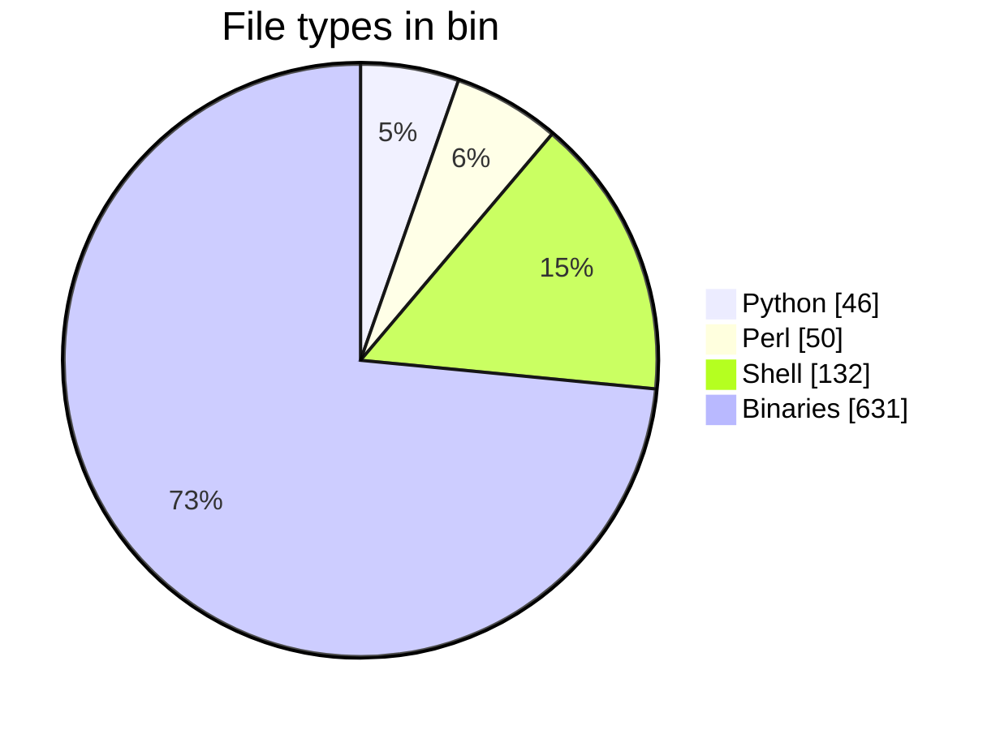
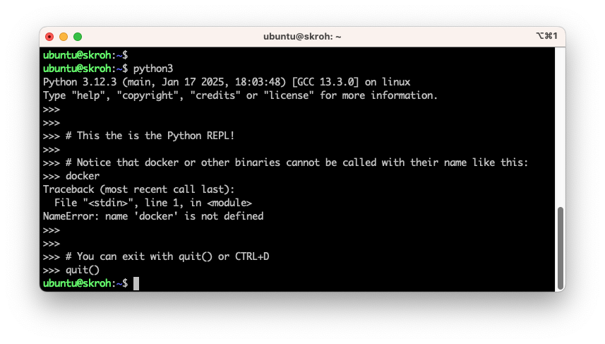

# Python 101

## Perusteet

### Missä ajetaan?

#### Docker

Aivan kuten aiemmissa osioissa käsitellyt kielet, myös Python-kieliset skriptit voidaan ajaa Docker-kontissa. Tämä on, aivan kuten ennenkin, kannattavaa jos teet jotakin riskialtista, kuten tuhoat tiedostoja. Kontti mahdollistaa ns. "clean slate" -ympäristön, jossa ei ole mitään ylimääräistä.

#### Lokaalisti

Python on valmiiksi asennettuna Ubuntussa ja monissa muissa Linux-jakeluissa. Windowsissa Pythonia ei ole valmiiksi asennettuna, mutta sen voi ladata ja asentaa [Pythonin kotisivuilta](https://www.python.org/downloads/). Asennuksen jälkeen Python on käytettävissä komentoriviltä, kunhan muistat aktivoida **Add Python to PATH** -valinnan asennuksen aikana.

!!! tip "Paketinhallinta... not today"

    :simple-python: Kun luot ==Python-ohjelmaa== tai -kirjastoa, käytät todennäköisesti virtuaaliympäristöjä tai jopa paketinhallintaaohjelmia, kuten [Python Poetry](https://python-poetry.org/) tai [uv](https://docs.astral.sh/uv/).

    :material-file-code: Kun kirjoitat ==skriptiä==, on jossain määrin oletettavaa, että käytät sitä Python-versiota, mikä sattuu olemaan asennettuna binäärissä `/usr/bin/python3`.

    Tässä luvussa emme luo ohjelmia vaan irrallisia skriptejä. Pyrimme pitämään asiat mahdollisimman yksinkertaisina, joten emme käytä virtuaaliympäristöjä, paketinhallintaa, emmekä edes asenna `pip`-paketteja. Käytämme sitä Python-versiota, mikä sattuu olemaan asennettuna.

Python on monilta osin cross-platform, joten skriptit toimivat samalla tavalla riippumatta siitä, ajatko niitä Windowsissa, Linuxissa vai macOS:ssä. Esimerkiksi hakemistopolut käyttäytyvät `pathlib`-kirjaston avulla samalla tavalla riippumatta käyttöjärjestelmästä: `Path` on alustasta riippuen joko `WindowsPath` tai `PosixPath`.

!!! warning

    Eroja tosin silti löytyy! Esimerkiksi tiedostoja kirjoittaessa kannattaa olla skarppina, että määrität eksplitiittisesti tiedoston enkoodauksen, sillä Windowsissa oletusenkoodaus on `win-1252`, kun taas Linuxissa ja macOS:ssä se on `utf-8`.

    Myös Linux-jakelut voivat yllättää muutoksillaan. Debianissa (ja myös Ubuntussa) on käytössä `dist-packages`-hakemisto, joka ei ole standardi Pythonin osalta. Tämä voi aiheuttaa esimerkiksi sen, että Ubuntu-käyttäjät luulevat `requests`-kirjaston olevan osa Pythonin Standard Libraryä.

### Mikä Python on?

Vapaasti suomennettu What is Python? Executive Summary on seuraava: 

!!! quote

    Python on tulkattava, olio-ohjelmointiin perustuva korkean tason ohjelmointikieli. Sen monipuoliset tietorakenteet, dynaaminen tyypitys ja sidonta tekevät siitä erinomaisen nopeaan sovelluskehitykseen sekä skriptauskieleksi eri komponenttien yhdistämiseen. Selkeä ja helposti opittava syntaksi parantaa luettavuutta ja vähentää ylläpitokustannuksia. Python tukee moduuleja ja paketteja, mikä edistää koodin uudelleenkäyttöä. Tulkki ja laaja vakiokirjasto ovat ilmaiseksi saatavilla kaikille merkittäville alustoille. [^pythonsummary]

[^pythonsummary]: Python.org. *What is Python? Executive Summary*. https://www.python.org/doc/essays/blurb/

Pythonin sijasta voisimme yhtä hyvin opiskella Perliä. Kumpikin kieli ponnistaa samankaltaisesta historiasta eli Unix-skriptauksesta. Aivan kuten `python3`, myös `perl` on mitä todennäköisimmin valmiiksi asennettuna jakelussasi. Perl on kenties kotikentällä skriptauksessaan vahvemmassa asemassa. Pythonin oma dokumentaatio tiivistää sen näin: *"As a consequence, Python comes close to Perl but rarely beats it in its original application domain; however Python has an applicability well beyond Perl's niche [^pythoncompare]"* Me käytämme Pythonia monista syistä, joita yksi on se, että kurssilla käsitelty Ansible on kirjoitettu Pythonilla. Toinen on se, että opiskelijat ovat usein jo käyttäneet Pythonia jossain muussa yhteydessä. Jos halut lukea Pythonin oman näkemyksen kielen vahvuuksista, lue esimerkiksi [Python Docs: Whetting Your Appetite](https://docs.python.org/3/tutorial/appetite.html)

[^pythoncompare]: Python.org. *Comparing Python to Other Languages*. https://www.python.org/doc/essays/comparisons/

Alla on piirakkakuvaajaan laskettuna Python, Perl ja Shell-skriptien sekä Linux-binäärien määrä `/usr/bin`-hakemistossa.



??? tip "Kuinka tiedostot laskettiin?"

    Komento on ajettu Multipassilla luodussa virtuaalikoneessa, jossa on arm64 Ubuntu 24.04. Komennon `find` syntaksi on hieman vaikea tulkita, mutta se suorittaa komennon `file <file_1> <file_2> <file_...>`. Kyseinen komento tulostaa rivin per tiedosto, joka sisältää päätellyt tiedostotyypin. Nämä rivit putkitetaan grep-komennon filtteröitäväksi, ja lopulta lasketaan filtterin läpäisseet rivit.

    ```console title="☣️ Bash"
    $ # Count Python scripts in /bin
    $ find /usr/bin -type f -exec file {} \+ | cut -d: -f2 | grep -i "python" | wc -l
    46
    $ # Count Perl
    $ find /usr/bin -type f -exec file {} \+ | cut -d: -f2 | grep -i "perl" | wc -l
    50
    $ # Count Shell scripts
    $ find /usr/bin -type f -exec file {} \+ | cut -d: -f2 | grep -i "shell" | wc -l
    132
    $ # Count binaries
    $ find /usr/bin -type f -exec file {} \+ | grep "ELF" | wc -l
    631
    ```


### Erot shelleihin

Huomaa, että Python ei käyttäydy shellinä samalla tavalla kuin Bash tai PowerShell. Pythonissa toki on olemassa niin sanottu Python Shell, mutta se ei ole shell sanan samassa merkityksessä. Pythonin Shell on "REPL" (Read-Eval-Print Loop), joka on interaktiivinen ohjelmointiympäristö. Tämä tarkoittaa, että voit kirjoittaa Python-koodia ja nähdä tuloksen välittömästi. Mikä sen sitten erottaa Bashista tai PowerShellista? ==Et voi suorittaa järjestelmäkomentoja suoraan Python Shellissä==. Eli siis `ls` ei tulosta hakemiston sisältöä, `cd` ei navigoi hakemistossa, `docker` ei kutsu Docker CLI:tä ja niin edelleen.

Selvyyden vuoksi täytyy painottaa, että vaikka emme voi kutsua PATH:ssa olevia binäärejä suoraan Python Shellistä, ==voimme kutsua== niitä `subprocess`-moduulin avulla. Näin myös tulemme kurssin aikana tekemään.



**Kuva 1:** Python Shell on interaktiivinen ohjelmointiympäristö, jossa voit kirjoittaa Python-koodia ja nähdä tuloksen välittömästi. Huomaa, että se käynnistetään tyypillisesti jonkin shellin child-prosessina: kuvan tapauksessa Bashin. Interaktiivista shelliä voi käyttää leikkikenttänä, mutta tyypillisesti Python ajetaan skriptinä.


## Ensimmäinen kontti

Aivan kuten edellisissä osioissa, myös Python-skriptit voidaan ajaa Docker-kontissa, mutta image pitää valita siten, että Python 3 on asennettuna.

```bash title="🖥️ Bash|Git Bash|PowerShell|CMD"
$ docker run -it --rm python:3.12
```

Komento suorittaa imagen default `Cmd`:n, joka on `python3`. Toisin sanoen käynnistät Python Shellin. Vaihtoehtoisesti voit antaa sille parametriksi polun skriptiin. Tähän tutustumme kurssin aikana.

## Skripti

### Sisältö

Huomaa, että shebang ei ole sinänsä osa Pythonia, eikä tyypillinen Python-ohjelma sisällä shebangiä. Alustamme on Unix-like, ja teemme skriptiohjelmointia, joten voimme kuitenkin hyödyntää sitä - ja näin tekevät `/usr/bin`-hakemiston Python-skriptitkin.

```python title="hello.py"
#!/usr/bin/env python3

print("Hello, world!")
```

### 🆕 Inline Script Metadata

!!! example "Tulevaisuus"

    Tämä on tuore feature ja siksi otsikossa on 🆕-emoji. Emme käytä ominaisuutta kurssilla, mutta koska se liittyy vahvasti skriptaukseen ja lienee tulevaisuudessa yleinen käytäntö, on hyvä olla tietoinen siitä.

PEP 723 (Python Enhancement Proposal) toi mukanaan Pythoniin uudistuksen [Inline Script Metadata](https://packaging.python.org/en/latest/specifications/inline-script-metadata/#inline-script-metadata). Kuinka tätä sitten hyödynnetään? Alla on esimerkki metadatan muotoilusta skriptin alkuun. Skriptiä ei voi ajaa suoraan Python 3.12:lla, vaan avuksi tarvitsee muita työkaluja, kuten `uv` tai `hatch`.

```python title="inline_metadata_example.py"
# /// script
# requires-python = ">=3.12"
# dependencies = [
#   "requests",
#   "pydantic",
# ]
# ///

import requests
from pydantic import BaseModel

class Post(BaseModel):
    userId: int
    id: int
    title: str
    body: str

# Fetch a dummy Post from REST API using Requests
response = requests.get("https://jsonplaceholder.typicode.com/posts/1")
post = Post.model_validate_json(response.content)
print(post.title)
```

Jos `uv` on asennettuna, voit ajaa skriptin seuraavasti:

```console
$ uv run inline_metadata_example.py
Installed 9 packages in 21ms
[INFO] The title:  sunt aut facere repellat provident occaecati excepturi optio reprehenderit
```

Huomaa, että inline-metadatassa listatut riippuvuudet (ja niiden riippuvuudet) asennettiin automaattisesti väliaikaiseen ympäristöön.

??? note "Entä kontissa?"

    Voit toki kokeilla samaa ominaisuutta myös kontissa. Esimerkiksi näin:

    ```bash
    docker run --rm -v "$(pwd)/scripts:/workspace" ghcr.io/astral-sh/uv:debian uv run /workspace/inline_metadata_example.py
    ```


### Ajaminen

Python skriptin voi ajaa joko argumenttina `python3`-ohjelmalle tai suoraan skriptinä, jos shebang on määritelty, ja tiedosto on ajettava (executable, `x` file mode).

```bash title="🖥️ Bash|Git Bash|PowerShell|CMD"
$ python3 hello.py
Hello, world!
$ ./hello.py
Hello, world!
```

### Bash Python-ajurina

On mahdollista hyödyntää Python-kieltä Bash-skriptissä. Tämä on hyödyllistä, kun haluat suorittaa jonkin operaation, mikä on merkittävän vaikea toteuttaa Bashilla. Jopa kohtalaisen yksinkertaisissa tapauksissa Python voi edistää syntaksin selkeyttä ja ymmärrettävyyttä - ja tämä on tärkeää, jos skriptiäsi joku muu joutuu lukemaan.

Kuvitellaan esimerkki, että sinun tulee selvittää, kuinka monta päivää on tietyssä kuukaudessa. Mieti hetki, kuinka tämä voisi onnistua Bashissä. Tämän jälkeen avaa alta vihjelaatikko, jossa on ainakin yksi ratkaisu tähän.

??? tip "Vihje: Kuukauden päivät Bashillä"

    Voit toteuttaa tämän Bashilla käyttämällä case-lauseketta. Helmikuu vaatisi kuitenkin karkausvuosien osalta poikkeuksen. Tämä ei ole maailman vaikein ohjelma, ja olet kenties jo aiemmassa harjoituksessa toteuttanut `is_leap_year` -funktion, jota voisi hyödyntää tässä.

    ```bash title="example_days_in_month.sh"
    #!/bin/bash
    # Usage: days_in_month.sh [month] [year]

    # Source imaginery is_leap_year function
    . is_leap_year.sh

    month=$1
    year=${1:-$(date +%Y)}
    
    case $month in
    1|3|5|7|8|10|12) days=31 ;;
    4|6|9|11) days=30 ;;
    1) 
        if is_leap_year $year; then
            days=29
        else
            days=28
        fi
        ;;
    esac
    ```

Saman voisi toteuttaa Pythonissa rautakoodattuna näin:

```python title="days_in_month.py"
import calendar
print(calendar.monthrange(2025, 2)[1])
```

Voimme upottaa seuraavan Python-rimpsun Bashiin näin:

```bash title="days_in_month_python.sh"
#!/bin/bash -eu
# Usage: days_in_month.sh [month] [year]

month=$1
year=${2:-$(date +%Y)}

n_days=$(python3 -c "
import calendar
print(calendar.monthrange($year, $month)[1])
"
)

echo "Number of days in $month/$year: $n_days"

```

!!! warning

    Miksi joku siis suosisi natiivia Bash-toteutusta? Yksi syy on, että Linuxissa on aina jokin POSIX-yhteensopiva shell saatavilla, toisin kuin Python. Tyypillisistä jakeluista `python3` löytyy, mutta konteissa ajetaan usein kovin karsittua imagea. Jos käytät Pythonia skripteissä, sinun pitää valita oikea image. Lisäksi vuosikymmeniä vanha POSIX-yhteensopivuus on melko vakaa verrattuna Pythonin versioyhteensopivuuteen.
    
    Käytännössä tässä taistelevat siis `portability + stability` vs. `readability + maintainability`.
    
    Tähän ei ole absoluuttisesti oikeaa ja väärää vastausta.

## Tehtävät


!!! question "Tehtävä: Python informaatiohaku"

    Muodosta itsellesi katalogi tarpeellisista lähteistä. Python kehittyy aktiivisesti, joten suosi uusia lähteitä. Alla pari suositusta, mistä aloittaa etsintä:
    
    1. [The Python Standard Library](https://docs.python.org/3/library/index.html). Pythonin oman dokumentaation Standard Library -osio on korvaamattoman hyvä. Pythonin mukana tulevien moduulien dokumentaatio on täällä. Kurssilla käytetään skriptaukseen liittyviä moduuleja, joista tärkeimpinä `os`, `sys`, `subprocess`, `argparse` ja `logging`. Mitä mahtaa tehdä esim. `calendar`? Entä `getpass`?
    2. [DevHints.io: Python](https://devhints.io/python). Cheat sheet, joka sisältää kielen perusasiat yhdessä paketissa. Tämän ja ylemmän lähteet avulla saat jo yllättävän paljon aikaiseksi.
    3. [Python strftime cheatsheet](https://strftime.org/). Jos/kun päädyt pelaamaan päivämäärien formatoinnin kanssa, tämä cheat sheet on nopea apu.
    4. [Python for DevOps: Learn Ruthlessly Effective Automation](https://kamezproxy01.kamit.fi:2252/lib/kajaani-ebooks/detail.action?docID=5993982). Kirja löytyy korkeakoulun Finna-kirjastosta digitaalisena kopiona. Voit lukea sitä selaimessa.
    
    Skriptaus on niin laaja käsite, että hakusanoilla "python scripting" ei yleensä löydä mitään hyödyllistä. Tee siis ensin tarkempi suunnitelma siitä, mitä aiot tehdä, ja muodosta tämän avulla hakusanasi. Kielimallit voivat auttaa hahmottamaan, millä kirjastoilla haluamasi ratkaisu hoituu.

    Jos olet valmis sijoittamaan opiskeluusi rahaa, myös seuraavat lähteet voivat olla varteenotettavia:

    * 💰 [Humble Bundle](https://www.humblebundle.com/). Sivustolla on ajoittain tarjolla kirjoja, jotka käsittelevät Bash-skriptauksen perusteita. Tarjonta vaihtelee jatkuvasti, joten on tuurista kiinni, löytyykö sieltä nyt mitään hyödyllistä. Kirjapaketit maksavat yleensä halvimmillaan noin 1-20 euroa.
    * 💰 [O'Reilly](https://www.oreilly.com/). Kirjastoon kuuluu useiden eri julkaisijoiden kirjoja: O'Reilly, No Starch Press, Manning Publications, Packt, Apress ja monet muut. Luettavissa kuukausimaksulla.
    * 💰 [Real Python: Subprocess](https://realpython.com/python-subprocess/). Real Python on maksullinen sivu, mutta maltillisen määrän artikkeleita saa lukea ilmaiseksi. Kun tiedät, mitä haluat, voit etsiä tietoa tarkemmin täältä. Tässä linkitetty artikkeli käsittelee `subprocess`-moduulia, joka on tärkeä osa Python-skriptauksen työkalupakkia.
  

## Lähteet