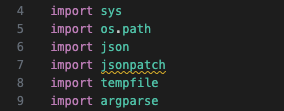
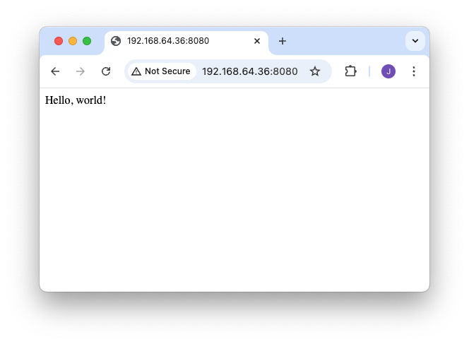

# Lukeminen

## Mistä on kyse?

Aloitetaan jo olemassa olevien skriptien lukemisesta. Aiemmissa luvuissa tutustuimme Bash ja PowerShell asennusskripteihin. Python ei ole Shell, joten on hieman harvinaisempaa, että asennusskripti on kirjoitettu Pythonilla. Sen sijaan me pengomme `/usr/bin`-hakemistossa sijaitsevia Python-skriptejä.

## Skriptien louhiminen

### Louhinta

Alla on skripti, jolla voit kopioida kaikki Python-skriptit virtuaalikoneesta. Skripti noutaa kaikki virtuaalikoneen skriptit ja kopioi ne hakemistoon `$REPO/python/ubuntu_python/`. Tämän sinä toki jo tiedät, koska osaat tulkita aiempien lukujen oppien avulla skriptin sisällön. Tämän luvun ensimmäinen tehtävä on luoda ja ajaa tämä skripti. Tarkempi tehtävänanto on alempana otsikon Tehtävät alla.

```bash title="getscripts.sh"
#!/bin/bash
# Usage: getscripts.sh [language]

language=${1:-python}
dirname="ubuntu_$language" 
vm_name="copycat"

# Create new virtual machine using multipass
multipass launch --name $vm_name lts

# List all scripts in the system
declare -a scripts
IFS=$'\n' read -d '' -r -a scripts < <(
    multipass exec "$vm_name" -- find /usr/bin -type f -exec file {} \+ | awk -F: -v lang="python" 'tolower($2) ~ lang {print $1}'
)

# Copy all files
for script in "${scripts[@]}"; do
  multipass transfer --parents ${vm_name}:$script ./$dirname/
  echo "Copied $script"
done

# Kill the virtual machine
multipass delete $vm_name
multipass purge
```

!!! tip

    Jos haluat hakea Perl-skriptit, aja sama komento argumentilla `perl`. Ne kopioidaan hakemistoon `$REPO/perl/ubuntu_perl/`. Et tarvitse Perl-skriptejä tällä kurssilla, mutta voit tutustua niihin ihan yleisen mielenkiinnon ja sivistyksen vuoksi.

### Katsaus

Kun olet ajanut skriptin, sinulla on hakemisto, jossa on kaikki Python-skriptit. Seuraavaksi valitset kolme skriptiä, joita tulet lukemaan. Valitse skriptit, jotka ovat tarpeeksi pitkiä ja monimutkaisia, jotta niiden lukeminen on mielekästä. Alla on listaus helmikuussa 2025 Ubuntu 24.04:stä löytyneistä skripteistä lyhyine kuvauksineen ja pituuksineen.

Alla taulukossa vain ne, joiden pituus on yli 100. Loput löytyvät admonitionin alta.

| Name                   | Lines | Purpose                                                       |
| ---------------------- | ----- | ------------------------------------------------------------- |
| unattended-upgrade     | 2522  | Automates system package upgrades for security and stability. |
| pygettext3.12          | 681   | Extracts translatable strings from Python source files.       |
| ubuntu-security-status | 579   | Reports security status of installed Ubuntu packages.         |
| networkd-dispatcher    | 547   | Dispatches network status changes to scripts.                 |
| pastebinit             | 474   | Uploads text to pastebin services from the command line.      |
| add-apt-repository     | 452   | Manages PPAs and other APT repositories.                      |
| apport-cli             | 419   | Command-line interface for Ubuntu's crash reporting tool.     |
| rrsync                 | 379   | Restricted wrapper for rsync.                                 |
| hwe-support-status     | 369   | Checks Ubuntu Hardware Enablement (HWE) support status.       |
| py3compile             | 323   | Compiles Python 3 files to bytecode.                          |
| oem-getlogs            | 307   | Collects system logs for OEM support.                         |
| ec2metadata            | 283   | Retrieves instance metadata on AWS EC2.                       |
| do-release-upgrade     | 260   | Upgrades Ubuntu to a newer release.                           |
| py3clean               | 210   | Removes Python 3 bytecode files.                              |
| apport-unpack          | 111   | Extracts crash reports for debugging.                         |
| jsonpatch              | 107   | Applies JSON patches to JSON documents.                       |

??? note "< 100 pitkät"

    | Name                | Lines | Purpose                                                  |
    | ------------------- | ----- | -------------------------------------------------------- |
    | jsonpointer         | 69    | Resolves JSON Pointer references.                        |
    | routel              | 62    | Displays routing table information.                      |
    | json-patch-jsondiff | 39    | Generates and applies JSON patches.                      |
    | sosreport           | 35    | Collects system diagnostic information.                  |
    | sos-collector       | 35    | Collects sosreports from multiple systems.               |
    | ubuntu-advantage    | 33    | Manages Ubuntu Advantage cloud services.                 |
    | ssh-import-id       | 33    | Imports SSH public keys from Launchpad/GitHub.           |
    | pyserial-ports      | 33    | Lists available serial ports.                            |
    | pyserial-miniterm   | 33    | Simple terminal for serial communication.                |
    | pybabel-python3     | 33    | Manages translations in Python projects.                 |
    | netaddr             | 33    | Provides network address manipulation utilities.         |
    | cloud-init          | 33    | Initializes cloud instances at boot.                     |
    | cloud-id            | 33    | Identifies cloud instance metadata.                      |
    | automat-visualize3  | 33    | Visualizes state machines from Automat library.          |
    | landscape-sysinfo   | 26    | Displays system information summary.                     |
    | sos                 | 25    | Command-line tool for gathering system information.      |
    | twistd3             | 8     | Runs Twisted-based applications as daemons.              |
    | twist3              | 8     | Twisted framework helper script.                         |
    | trial3              | 8     | Runs unit tests for Twisted applications.                |
    | tkconch3            | 8     | SSH client using Twisted Conch.                          |
    | pyhtmlizer3         | 8     | Converts Python source code to HTML.                     |
    | pygmentize          | 8     | Highlights syntax of source code.                        |
    | markdown-it         | 8     | Processes Markdown with markdown-it library.             |
    | mailmail3           | 8     | Sends email using the mailmail utility.                  |
    | jsonschema          | 8     | Validates JSON data against schemas.                     |
    | conch3              | 8     | Twisted Conch SSH framework utility.                     |
    | ckeygen3            | 8     | Generates SSH keys using Twisted Conch.                  |
    | chardetect          | 8     | Detects character encoding of text files.                |
    | cftp3               | 8     | FTP client using Twisted Conch.                          |
    | pydoc3.12           | 5     | Displays Python documentation in a pager or web browser. |

!!! tip "Kuinka lista tehtiin?"

    Lista on alustettu komennolla:

    ```bash
    cd ubuntu_python
    find . -type f -exec wc -l {} \; | sort -k1 -r
    ```

    Kokeile ihmeessä komentoa omassa hakemistossasi! Komennon tuloste on syötetty ChatGPT 4o -mallille, jota on pyydetty täydentämään kunkin skriptin *purpose*. Huomaa, että ChatGPT voi olla väärässä! Kun valitset omat kolme skriptiäsi, tarkista niiden osalta, ettei ChatGPT ole antanut virheellistä tietoa.

## Tärpit

Tämän luvun toinen tehtävä on tutustua Python-skripteihin, jotka kopioit virtuaalikoneesta host-koneellesi. Osa skripteistä voi olla hieman vaikea lähestyä, jos et ole Pythonin kanssa ennen työskennellyt. Tämän otsikon alaotsikoissa käsitellään muutamat vinkit, joiden avulla voit paremmin ymmärtää skriptien toimintaa.

### Sisennyt

Toisin kuin Bash ja PowerShell, Python käyttää sisennystä (engl. indentation) koodin rakenteen määrittämiseen. Aiempien kielten skripteissä olet nähnyt sisennystä käytettävän, mutta syynä on pelkkä luettavuuden parantaminen. Pythonissa sisennys vaikuttaa toiminnallisuuteen. Sivuoireena Pythonissa koodiblokin ympärille ei tarvitse laittaa sulkeita esimerkiksi if-lausekkeissa.

Esimerkiksi:

```python
if True:
    print("<= Huomaa sisennys. Tämä toimii!")

if True:
print("<= Huomaa puuttuva sisennys. Tämä nostaa IndentationError-virheen!")
```

Vertaa tätä PowerShellin syntaksin kanssa:

```pwsh
if ($true) {
Write-Host "Tämä toimii!"; Write-Host "Tämäkin toimii!";
    Write-Host "Ja tämä!"
}
```

!!! tip

    Sisennys voi olla esimerkiksi 2 välilyöntiä, 4 välilyöntiä tai tabulaattori. Pythonin PEP 8 -ohjeistus suosittelee 4 välilyönnin käyttöä. Minkä ikinä valitsetkin, pidä se koko skriptin (tai projektin) ajan samana.

    Puolipistettä voi käyttää Pythonissa erottamaan monta komentoa toisistaan, mutta se ei ole konvention mukaista.

### Toimimattomat importit

Jos parsit Python-skriptiä lokaalilla koneella, joka ei ole Ubuntu, huomannet, että VS Code varoittaa joidenkin importtien olevan toimimattomia.



**Kuva 1:** VS Code:n Pylance varoittaa keltaisella alleviivauksella, että `jsonpatch`-moduuli on toimimaton. Kuvakaappaus on otettu macOS-koneelta, jossa ei ole kyseistä moduulia. Parsittava tiedosto on `jsonpatch`.

Nämä toimimattomat importit liittyvät Debian-pohjaisen Ubuntun tapaan käyttää suurta määrää esiasennettuja moduuleita. Moduulit löytyvät hakekistosta: `/usr/lib/python3/dist-packages/`. Yllä olevan esimerkin (ks. Kuva 1) epätoimiva import `jsonpatch` ei suinkaan ole kyseinen tiedosto itse, vaikka kyseinen tiedosto sattuu olemaan nimeltään sama. Kyseessä on `jsonpatch`-niminen kirjasto. Useimmat kirjastot löytyvät PyPi:stä eli Python Package Indexistä. Näinpä esimerkiksi `jsonpatch`:n dokumentaatio löytyy osoitteesta: [https://pypi.org/project/jsonpatch/](https://pypi.org/project/jsonpatch/).

### Multipass

Yllä esitelty skripti luo virtuaalikoneen nimeltään `copycat`. Voit hyödyntää vastaavia komentoja luomaan sinulle oman koneen, jonka sisällä voit harjoitella interaktiivisia komentoja. Esimerkiksi:

```bash
# Luo kone SKR(ipti)OH(jelmointi)
multipass launch --name skroh lts

# Näet koneen tiedot näin (esim. ip-osoite)
multipass info skroh

# Avaa koneen terminaali
multipass shell skroh

# Poista kone
multipass delete skroh

# Poista jäänteet
multipass purge
```

### Skriptin koeajo

Skriptin ajaminen voi hyvin antaa konkretiaa siihen, mitä skripti oikeastaan tekee. Olettaen että olet Multipassilla luodun virtuaalikoneen sisällä, skriptien ajaminen on turvallista. Siispä kannattaa kokeilla, saatko esimerkiksi ChatGTP:n ja dokumentaation avulla skriptin tavalla tai toisella käyttöön!

Esimerkiksi skripti `/usr/bin/twist3` muuttuu paljon konkreettisemmaksi, kun kokeilet ajaa sitä. Alla on komennot, joilla Twisted-webbiserveri käynnistetään. Web-palvelimen lisäksi Twisted osaa myös DNS, FPT ja muita protokollia. Web-serveri on kuitenkin nopea testata, koska tarvitsemme vain `index.html`-tiedoston johonkin hakemistoon. Luodaan se `~/www`.

```console
$ cd
$ mkdir www
$ echo 'Hello, world!' > www/index.html
$ /usr/bin/twist3 web --path=www
2025-02-24T10:16:43+0200 [-] Site starting on 8080
2025-02-24T10:16:43+0200 [twisted.web.server.Site#info] Starting factory <twisted.web.server.Site object at 0xea8a0140fad0>
2025-02-24T10:16:43+0200 [twisted.application.runner._runner.Runner#info] Starting reactor...
```

!!! tip 

Tyypillinen kielimalli osaisi tarjota sinulle nämä komennot, jos minä en niitä tarjoaisi. Käytä tekoälyä apuopettajanasi!  🤖

Nyt voit avata selaimen ja mennä osoitteeseen `http://<multipass-vm-ip>:8080`. Saat ip-osoitteen selville yllä esitellyllä `multipass info`-komennolla.



**Kuva 2:** Twisted www-palvelimen tarjoilema `index.html`-tiedosto näkyy host-koneen selaimessa.

!!! note

    Huomaa, että `twist3` ja `twistd3` ovat eri skriptit. Jälkimmäisen `d` tulee sanasta daemon, joka tarkoittaa taustaprosessia. Jos ajat saman komennon sitä vasten, syntynyt prosessi ei jää shelliin. Löydät sen prosessilistalta komennolla `ps aux | grep twist` ja voit tappaa sen komennolla `kill <pid>`.

## Tehtävät

??? question "Tehtävä: Python Devausympäristö"

    Ensimmäisenä tehtävänä luot itsellesi devausympäristön. Käytännössä luot:

    * Hakemistorakenteen tehtävien vastauksia varten
    * Skriptin `getscripts.sh`, joka:
        * Sisältää yllä esitellyn koodin, ja täten...
        * Käynnistää multipass-virtuaalikoneen nimeltään `copycat` 🐱
        * Kopioi skriptit sinun lokaalille koneelle `ubuntu_python/`-hakemistoon
        * Tuhoaa virtuaalikoneen
    * Valitset ja säilytät n kappaletta Python-skriptejä, joita tulet lukemaan
    * Saat tuhota loput skriptit
    * Varmistat, että kaikki tarpeellinen on versionhallinnassa

    On oletus, että työskentelet yhä samassa hakemistossa ja repositoriossa, missä Bash ja PowerShell-osiotkin on tehty. Esimerkiksi:

    🐧 linux: `/home/uname/Code/skriptiohjelmointi-2054/johnanderton`
    
    Luo repositorion sisälle uusi `python/`-hakemisto ja sen sisälle sekä yllä mainittu skripti että hakemisto skriptejä varten. Repositoriosi rakenteen tulisi olla seuraavaa myötäilevä:

    ```plaintext
    johnanderton
    ├── README.md
    ├── bash
    │   └── .gitkeep 
    ├── pwsh
    │   └── .gitkeep 
    └── python
        ├── README.md
        ├── getscripts.sh
        └── scripts
            ├── kaikki.py
            ├── skriptit.py
            └── tanne.py
    ```

    Tiedosto `getscripts.sh`:n sisältö on esitelty yllä. Luo ja aja se.

??? question "Tehtävä: Parsi Python-skriptit"

    Tee sama kuin teit Bashin ja PowerShellin vastaavassa tehtävässä. Erona on se, että skriptit eivät ole tällä kertaa netistä löytyviä (tai löytyisi ne sieltäkin), vaan skriptit on louhittu virtuaalikoneen sisältä. Muista, että sinun ei tarvitse ymmärtää syvällisesti aivan jokaisen rivin toimintaa. Tutustu skriptiin ja sen syntaksiin pinnallisesti. Tutki, kuinka skripti on rakennettu ja mitä se tekee yleisellä tasolla, ja mistä konkreettisista palasista (esim. `if`) se koostuu.
    
    Vaiheet:

    1. Tee yllä oleva tehtävä, jotta `ubuntu_python/`-hakemistossa on skriptit
    2. Valitse kolme skriptiä. 
        * Älä valitse liian lyhyitä.
        * Voit tuhota loput skriptit.
    3. Aloita tiedoston ylhäältä ja prosessoi se rivi riviltä.

    Tee seuraavat toimenpiteet jokaiselle skriptille:

    * ✅ Jos koodirivi sisältää entuudestaan vierasta syntaksia: dokumentoi se. 📄
    * 🔁 Jos koodirivin syntaksi on jo esiintynyt aiemmin scriptissä: unohda rivi. 🫳
    * (Optional: Tämän jälkeen poista kyseinen koodirivi tiedostosta.)

    Tämän pitäisi olla sinulle jo entuudestaan tuttua.

    !!! tip "Ajansäätöä tekoälyllä! 🤖"

        Tämän pitäisi olla sinulle aiemmista luvuista tuttu ohje! On suorastaan suositeltua käyttää tekoälyä apuna selittämään, mitä kyseiset Powershell-kielen entuudestaan tuntemattomat koodirimpsut tekevät. Älä ulkoista omia aivojasi, vaan käytä tekoälyä apuna!